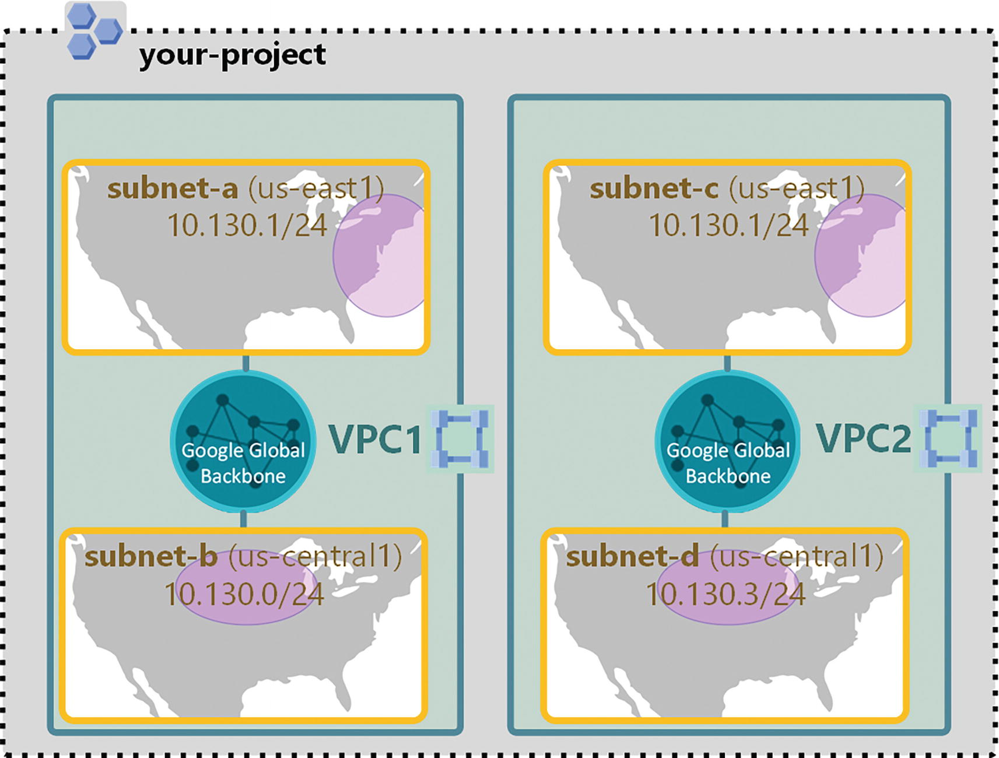

# Chapter 2. Designing, Planning, and Prototyping a Google Cloud Network

In the cloud, the compute elements of the workload - VMs, GKE nodes, Cloud Run container instances, App Engine instances are interconnected using *software-defined networking*.

Software-defined networking uses software-based controllers or application programming interfaces (APIs) to communicate with underlying hardware infrastructure and
direct traffic on a network. Software-defined networking is much more flexible than traditional networking. As a result, it allows administrators to control the network, change configuration settings, provision resources, and increase network capacity—all from a centralized user interface, without the need for more hardware.

## Designing an Overall Network Architecture

Show Contents

The most important component of the network architecture in the Google Cloud Platform (GCP) is the *Virtual Private Cloud (VPC)*.

A VPC is a virtual version of a physical network. Unlike other public clouds, VPC networks are global resources, that is, a single VPC can span multiple regions without communicating over the public Internet. This means you can connect and manage resources distributed across the globe from a single Google Cloud project. You can also create multiple, isolated VPC networks in a single project.

VPC networks do not define IP address ranges. Instead, each VPC network is comprised of
one or more partitions called *subnets*. Each subnet in turn defines one or more IP address ranges. Subnets are regional resources; each subnet is explicitly associated with a single region.

All compute resources of the workload rely on a VPC network’s routing capabilities for
communication. The VPC connects—by default—the resources to each other. Additionally, the VPC can be connected to other VPCs in GCP, on-premises networks, or the Internet. However, this external form of communication does not happen by default. You have to explicitly configure it.

The design of the overall network architecture is the result of the workload business and technical requirements:

-  Do you need zonal, regional, or global (multi-regional) redundancy for the resources
(e.g., compute, storage, etc.) in the workload?

- Are high performance and low latency must-have characteristics of the workload?

- Does the workload use sensitive data that must be protected in transit, in use, and
at rest?

- Does the workload need to operate in a hybrid environment (i.e., some components of the workload are located on-premises—in the data center—other components are located in GCP, and others might even be located in other public clouds)?

- What’s the trade-off between cost and the other nonfunctional requirements earlier?

The following sections provide the rationale behind the architectural decisions you need to make when you design your network in GCP.

### High Availability, Failover, and Disaster Recovery Stratgies

Show Contents

contents
    

    
## Designing Virtual Private Cloud (VPC) Instances

Show Contents

contents
    

## Designing a Hybrid and Multi-cloud Network

Show Contents

contents
    

## Designing an IP Addessing Plan for Google Kubernetes Engine (GKE)

Show Contents

contents
    

