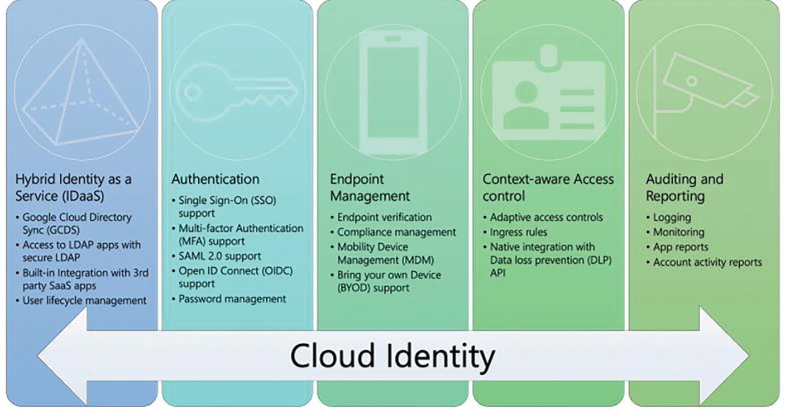
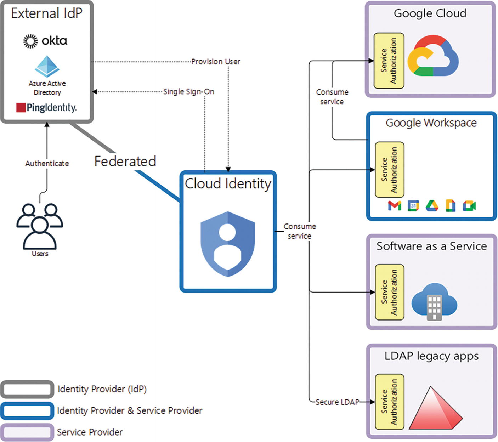
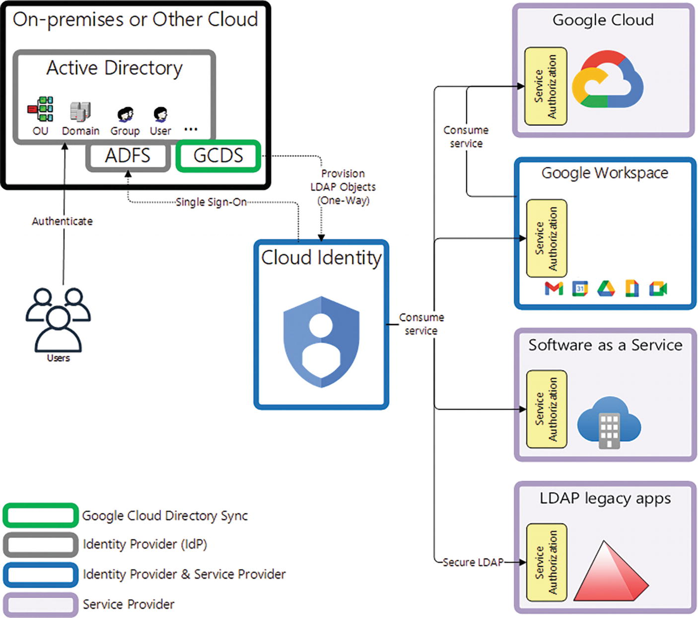
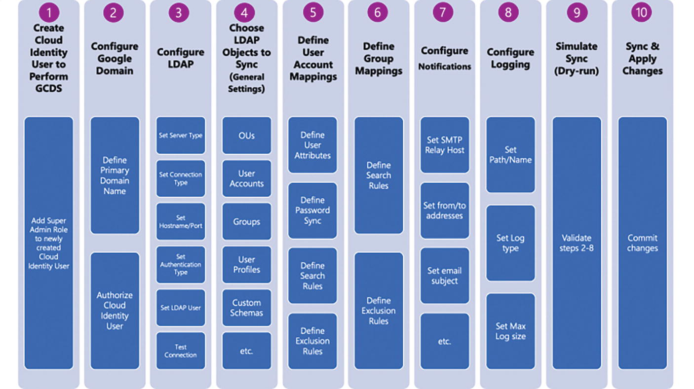
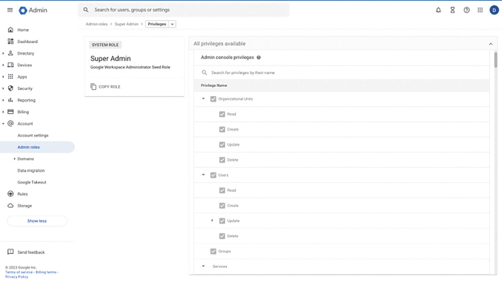

# Chapter 2. Configuring Access

From a security standpoint, when dealing with access to data, it
is critical that the service responsible for providing access is designed
to ensure **confidentiality**, **integrity**, and **availability** at a minimum. Confidentiality is required to prevent your data from being used by unauthorized individuals. Integrity ensures the data has not been altered in an unauthorized manner. Availability is also required to make sure your data is accessible to authorized users when needed, no matter where you are, which device(s) you are using, and what time of the day.

As a result, a modern approach to identity and device management is needed.

There are two Google Identity services: **Cloud Identity**, and **Google Workspace**. We will focus on Cloud Identity here. We will learn 

- how to configure Google Cloud Directory Sync (GCDS) to synchronize your GCP identities and groups to match the information in the LDAP (Lightweight Directory Access Protocol) server of your organization. 

- the safeguards to protect your organization’s privileged accounts: the Super Administrator account and all the different types of service accounts. 

- a number of authentication and authorization approaches

- Google Cloud resource hierarchy— organizations, folders, projects, and resources—and the concepts of IAM, as well as some of the helpful services that can help you validate and address permission issues.

## Introduction to Information Security Principles

<details><summary style="color:Maroon;font-size:16px;">Show Contents</summary>

1. **Least Privilege**: The principle of least privilege is about giving to someone (or to something for nonhuman identities, e.g., machines) the bare minimum set of permissions they need to do the work they were assigned to do. For example, if you need permissions to read a file from a Google Cloud Storage (GCS) bucket, you don’t need to be an administrator of that bucket.

2. **Defense in Depth**: The principle of defense in depth is an approach to information security that leverages layers of protection. If an adversary is able to breach one layer of defense, the next layer should prevent them from harming your applications or exfiltrating your data. Each layer is comprised of a number of countermeasures that as a whole implement a kind of fortification to protect the next layer.

3. **Separation of Duties**: The NIST SP 800-192 (National Institute of Standards and Technology Special Publication) defines separation of duties as the principle that no user should be given enough privileges to misuse the system on their own. For example, the person authorizing a paycheck should not also be the one who can prepare them.

    By separating duties, different users (or machines) are given authority over only a limited subset of the overall system they need. This approach minimizes the damage a single privileged user might cause by ensuring that certain operations require more than one user’s authority.

4. **Minimize the Attack Surface**: The more complex a system is, the larger is its exposed attack surface. For example, a system that is comprised of only two parts has only its external surface and the surface of its two parts to protect from bad actors, whereas a system that is comprised of ten parts has a lot more to protect. The exposed attack surface of the former system is smaller than the exposed attack surface of the latter system because the system with ten parts is more complex than the system with only two parts.

    As a result, reducing a system complexity can make a system harder to attack. There are a number of ways to decrease the complexity of a system. Some of the elements to consider include the following:

    - **Number of interfaces**: Reducing the number of access points ensures only a few “ports of entry” need to be controlled. Even better, make sure the interfaces for each “point of entry” are small and simple.

    - **Number of consumers**: Limiting the number of users (or machines) that consume the services exposed by your system streamlines your ability to control who did something, where, and when.

    - **Number of lines of code**: It is easier to control and protect a modular system than a monolithic system. Modular systems are comprised of several components, each intended to perform a specific task. The interaction among the components leverages small, clean, carefully designed, and built interfaces, resulting in lower complexity than a monolithic system: the lower the complexity, the smaller the attack surface.

5. **Limiting the Blast Radius**: The blast radius of a security incident is defined as the amount of damage that the incident could potentially cause. It’s every account, file, application, database, server, or other corporate assets that could be compromised once an adversary has gained access to your system.

    An approach to limit the blast radius is segmentation. The concept of segmenting security controls into smaller subcomponents or cells means that should the worst-case scenario happen, the impact is limited.
    
</details>

## Managing Cloud Identity

<details><summary style="color:Maroon;font-size:16px;">Show Contents</summary>

The *BeyondCorp* enterprise security model developed by Googleis based on the assumption that any identity requesting data connects from untrusted networks without using traditional virtual private networks (VPNs). This approach encompasses the scenarios where a request for data might originate from an office, from home, from a hospital, while traveling, etc.

To allow this paradigm shift, BeyondCorp has moved access control from the network perimeter to a combination of individual identities, devices, and their contextual data (e.g., location, time, access patterns, and others) as the new, modern perimeter. The idea was to trust no network (i.e., zero networks are to be trusted), resulting in every request to applications or data to be encrypted, authenticated, and authorized.

Cloud Identity is an *Identity-as-a-Service* and *enterprise mobility management (EMM)* product that implements the BeyondCorp enterprise security model. It brings to organizations a single pane of glass that provides unified administration of identities, devices, and applications.



### Understanding Identities, Principals, and Accounts

<details><summary style="color:Maroon;font-size:16px;">Show Contents</summary>

An *identity* (also referred to as *principal*) is a name that uniquely denotes the consumer of a service. The consumer is also referred to as an *account* and may be a human or a service account. Google uses an email address as a form of identity.

*Authentication* (also referred to as *sign-in*) is the process of verifying the association between an account and an identity, that is, the account’s email.

>---
>
>**Note** An account might have multiple email addresses. Because google services use an email address as a form of identity, such an account would be considered to have multiple identities.
>
>---

Cloud Identity handles the authentication process. When you authenticate to Cloud Identity, it verifies whether your credentials (email address and some data)  matches the data stored in its database to determine access or denial. This data can be your password (something you know), your biometrics (something you are), or your authenticator device (something you have).

An *account* is a rich data structure with attributes (e.g., first name, last name, phone number, etc.), which is associated to an identity and whose behavior is tracked when the identity (email) consumes a service. Accounts are provisioned by identity providers (IdPs), such as Cloud Identity or Google Workspace, and are uniquely identified by an ID generated by the identity provider and stored in its database. User interfaces or APIs require you to reference the account indirectly by its associated identity, that is, gianni@dariokart.com.

There are two types of accounts: Consumer accounts, and Managed accounts.

*Consumer accounts* are intended for personal use and are identified by an email address with the gmail.com domain. They can also be denoted by another non-gmail.com alternate identity (email address). Unlike managed accounts, consumer accounts are managed by you in a self- service fashion. You can create your consumer accounts, update them, or delete them without asking permission to an administrator.

*Managed accounts* are intended for business use. They are managed in the context of an organizational unit defined in Cloud Identity or Google Workspace. The administrator of the organizational unit is responsible for managing the account.

The usage of the email address as a form of identity (instead of its internal IdP-generated ID) allows for the account object to be decoupled from its identity. As a result
1. A consumer account can have more than one identity.
2. An identity can reference more than one account.
3. Managed identities can be changed.

</details>

### Federating Cloud Identity

<details><summary style="color:Maroon;font-size:16px;">Show Contents</summary>

Your organization may already use its own identity provider (IdP), for example, Azure Active Directory (Azure AD), Okta, or PingIdentity.
To let your organization capitalize on its existing IdP’s investment, Cloud Identity or Google Workspace can be federated with your organization’s.



By federating Cloud Identity with an external IdP, the users of your organization can consume Google Cloud, Google Workspace, or other services (e.g., Software-as-a-Service (SaaS) applications offered by a third-party vendor or services provided by LDAP legacy applications) and still authenticate to your organization’s IdP. Here is an example:

1. Upon requesting the desired service, for example, access to Google Drive, the user is required to sign in to Cloud Identity or Google Workspace with the user’s email address only.

2. Next, Cloud Identity (or Google Workspace) redirects the federated user to their organization’s IdP sign-in page.

3. Upon successful authentication, the service provider (Google Workspace) performs access control (service authorization) on the requested service (Google Drive). If the service authorization is cleared, then the user can consume the requested service.

Cloud identity and google Workspace are not limited to an idp. they can operate as an identity provider and service provider simultaneously.

There are other ways to integrate Cloud Identity and Google Workspace with external IdPs and service providers. A detailed list of reference topologies can be found at https://cloud.google.com/architecture/identity/reference-architectures.

</details>

### Configuring Google Cloud Directory Sync (GCDS)

<details><summary style="color:Maroon;font-size:16px;">Show Contents</summary>

Google Cloud Directory Sync (GCDS) is a free tool provided by Google, which is intended to automatically synchronize users, groups, domains, organizational units (OUs), and any other LDAP objects from your Microsoft Active Directory server (or OpenLDAP-compatible LDAP server) so that the data in Cloud Identity (or Google Workspace) matches the data in your LDAP server.

GCDS always performs a one-way synchronization, from your active Directory (or LDAP) server to Cloud Identity. GCDS never updates data on your LDAP server. Your active Directory (or LDAP) server is the IdP authoritative source.

The following diagram shows how GCDS fits in the overall Cloud Identity architecture. 



Assuming we use Active Directory, the user experience is described as follows:

1. Upon requesting the desired service, for example, access to a Google Cloud Compute Engine instance (i.e., a virtual machine), the user is redirected to the Cloud Identity (or Google Workspace) sign-in screen, which prompts them for their email address.

2. Cloud Identity (or Google Workspace) redirects the federated user to the sign-in page of AD FS (Active Directory Federation Services).

3. Depending on the configuration of AD FS, the user might see a sign-in screen prompting for their Active Directory username and password. Alternatively, AD FS might attempt to sign the federated user in automatically based on their Windows login.

4. Upon successful authentication, the service provider (Google Cloud) performs access control (service authorization) on the requested service (Google Cloud Compute Engine). If the service authorization is cleared, then the user can consume the requested service.

How does GCDS know how to access the LDAP objects in Active Directory? Also, how does it know which of these objects are to be pushed to Cloud Identity (or Google Workspace)?

GCDS comes with a wizard-like user interface—called the Configuration Manager—that is intended to help you configure all aspects of the one-way synchronization. 



1. GCDS requires a Google Identity to populate your Cloud Identity
(or Google Workspace) organization. This identity is solely devoted to the task of importing the selected LDAP objects from the Active Directory (or LDAP) server into Cloud Identity (or Google Workspace). This identity is assigned the Super Admin role. Behind the scenes, GCDS uses the Directory API and the Domain Shared Contacts API to perform the push of the LDAP objects in bulk. 

2. GCDS also needs to know which organizational domain (or primary domain) you want to synchronize. If you are using Google Workspace, the primary domain can be found in the Google Admin console.

3. **Where** are the sources of the LDAP objects to be synchronized? You must specify a hostname and a port for your Active Directory (or LDAP) server. If you use Active Directory, you can use 3268 (Global Catalog) or 3269 (Global Catalog over TLS/SSL). If you use an OpenLDAP-compatible server, you can use 389 (Standard LDAP) or 636 (LDAP over TLS/SSL).

4. **How**: You must tell GCDS whether or not you want an encrypted LDAP connection to your authoritative IdP (Active Directory or LDAP server). This is best practice and can be achieved by using the LDAPS protocol— LDAP over TLS/SSL.

5. **Who**: You must tell GCDS who will access the IdP LDAP objects. In the case of Active Directory, this is a domain user with sufficient read access. Rather than reusing an existing Windows user, it is best practice to create a dedicated user for GCDS.

6. **What**: You must tell GCDS what LDAP object types (or object classes) you want to synchronize. This is a list that typically includes organizational units (OUs), user accounts, groups, user profiles, custom schemas, shared contacts, calendar resources, and licenses. Once you choose the LDAP object class you want, you can select the objects to be imported within the class by using an LDAP filter, for example, `(&(objectCategory=person)(objectClass=contact) (|(sn=Smith)(sn=Johnson)))`, which denotes an LDAP filter to select all contacts whose last name is equal to “Smith” or “Johnson.”

Lastly, you are asked to define your suitable level of logging and instrumentation so that you have a way to track or audit how the one-way sync went and be promptly notified whenever an error occurs.

It is important you know that the GCDS one-way sync can be tested in “dry-run mode” (step 9), before execution (step 10). 

</details>

### Managing a Super Administrator Account

<details><summary style="color:Maroon;font-size:16px;">Show Contents</summary>

A Super Administrator—or simply a Super Admin—account is a special, privileged account used to configure an organization resource with Cloud Identity or Google Workspace.  It is a Cloud Identity or a Google Workspace account that has the system role `Super Admin` assigned to its identity (email address).

You can list all Super Admins in Google Workspace Admin console by clicking the “View admins” link.

This is the most powerful account a Google Identity can have for its organization.

A google Workspace or Cloud identity account is associated with one—and only one—organization resource. An organization resource is associated with exactly one domain, which is set when the organization resource is created.

Whether you are using Google Workspace or Cloud Identity, your organization resource will be automatically created for you upon associating your account with a domain. The organization will be provisioned at different times depending on your account status:

- New Google Cloud user: If you are new to Google Cloud and have not created a project yet, the organization resource will be created for you when you log in to the Google Cloud console and accept the terms and conditions.
- Existing Google Cloud user: The organization resource will be created for you when you create a new project or billing account. Any projects you created previously will be listed under “No organization,” and this is normal. The organization resource will appear, and the new project you created will be linked to it automatically. You will need to move any projects you created under “No organization” into your new organization resource. 

When the organization resource is created, an email is sent to the Google Workspace or Cloud Identity Super Admins. Upon creating an organization, an organization ID is generated, and all users in your domain are automatically granted Project Creator (`roles/resourcemanager.projectCreator`) and Billing Account Creator (`roles/billing.creator`) IAM roles at the organization resource level. This enables users in your domain to continue creating projects with no disruption.

You will need the organization ID when configuring the scope of IAM
allow policies. You can run the following command to retrieve the organization ID:

```bash
gcloud organizations list --uri
```

An organization Super Administrator is the first user who can access the Google Cloud organization resource upon creation. The Google Workspace (or Cloud Identity) Super Admin role and the Google Cloud Organization Administrator role are two key distinct roles. The structure of your organization resource drives which identities or group of identities should be assigned these two roles.

This is by design and conforms to the principle of separation of duties, so that the task of administering your Google Workspace or Cloud Identity resources is separated from the task of administering your Google Cloud organization resource.

The Google Workspace (or Cloud Identity) Super Admin role has permissions to read/create/update/delete the following resources in the organization resource.

- Organization units

- Users

- Groups

- Services, such as Gmail, Drive, Docs, Sheets, Slides, and etc.



Instead, the permissions of the Google Cloud Organization Administrator role are limited to assigning Identity and Access Management (IAM) roles to other identities; that’s it! It does not include permissions to create, update, or delete GCP resources (e.g., folders, projects, VMs, Google Kubernetes Engine clusters, Cloud Storage Buckets, and so on). Run the following command to list the permissions of the Organization Administrator IAM role.

```bash
gcloud iam roles describe roles/resourcemanager.organizationAdmin
```

The best way to protect your Super Admin account is by limiting its exposure to potential threats. This can be accomplished by following these steps in sequence:

1. Enforce multifactor authentication (MFA) on your Super Admin accounts.

2. Add a Super Admin recovery email address.

3. Designate Organization Administrators.

4. Create an Organization Administrator group.

</details>

### Administering User Accounts and Groups Programmatically

<details><summary style="color:Maroon;font-size:16px;">Show Contents</summary>

There are two solutions to administer and automate user lifecycle management: Cloud Identity automated provisioning and third-party Just-in-Time provisioning.

Cloud Identity has a catalog of automated provisioning connectors, which act as a bridge between Cloud Identity and third-party cloud applications.

Once you’ve set up SAML (Security Assertion Markup Language) for Single Sign-On (SSO), you can set up automated user provisioning to create, update, or delete a user’s identity across your cloud applications. Administrators can authorize Cloud Identity to synchronize a subset of their Cloud Identity users to one or more supported applications.

This approach has the following benefits:
- Accommodates the full user lifecycle by creating, updating, removing, or suspending user profiles
- Accommodates full app lifecycle management by enabling companies to add or remove applications from their organization in a central location
- Provides a consistent user experience for all supported applications, including unified reporting, audit logs, and granular event tracking

Many applications that support SAML can be automatically provisioned through Just-in-Time (JIT) provisioning. Some service providers set up their SAML application so that when a user accesses their application, it checks to see if the user already has an account. If they don’t have an account, one is created for them.

The main benefits of this solution are as follows:
- It requires less configuration, because only SAML application setup is required.

- Customers might be able to influence service providers to support JIT provisioning for applications where Cloud Identity currently doesn’t have automated provisioning connectors.

Some of the disadvantages to consider are as follows:

- It doesn’t support user deprovisioning, which requires manual intervention to remove application licenses for users who leave a company.

- Not all third-party cloud applications support JIT provisioning.

- Compared to the consistent Cloud Identity automated provisioning connectors, third-party connectors can vary in how they work and what’s included in their reports and logs.

</details>

</details>

## Managing Service Accounts

<details><summary style="color:Maroon;font-size:16px;">Show Contents</summary>

A *service account* is a nonhuman identity that a VM or an application can use to run API requests on behalf of a group of authorized identities. Modern applications don’t operate in silos. They need data from other systems (servers, i.e., VMs) or other applications to complete their tasks and return a response to their users. When they request data from other systems or applications, they need to sign in so that the request can be tracked—or audited if the application operates in a highly regulated industry. A service account is a special identity whose only purpose is to perform authentication on behalf of the application or the VM where the application runs is necessary. 

Unlike a user account, A service account is an identity and a rest resource at the same time. To view the REST resource definition for a service account, visit https://cloud.google.com/iam/docs/reference/rest/v1/projects.serviceAccounts.


</details>

## Managing Authentication

<details><summary style="color:Maroon;font-size:16px;">Show Contents</summary>

</details>

## Managing and Implementing Authorization

<details><summary style="color:Maroon;font-size:16px;">Show Contents</summary>

</details>

## Defining Resource Hierarchy

<details><summary style="color:Maroon;font-size:16px;">Show Contents</summary>

</details>

<style>
    h1 {
        color: DarkRed;
        text-align: center;
    }
    h2 {
        color: DarkBlue;
    }
    h3 {
        color: DarkGreen;
    }
    h4 {
        color: DarkMagenta;
    }
    strong {
        color: Maroon;
    }
    code {
        color: Maroon;
    }
    em {
        color: Maroon;
    }
    img {
        display: block;
        margin-left: auto;
        margin-right: auto
    }
    code {
        color: SlateBlue;
    }
    mark {
        background-color:GoldenRod;
    }
</style>