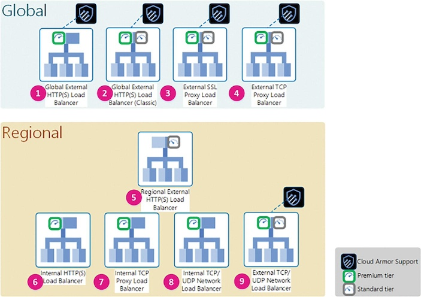

# Chapter 3. Configuring Perimeter and Boundary Security

This chapter's focus is the "*where*".


Following the defense in depth principle, the first layer of defense is provided by software-defined firewalls—as distributed, highly available, fault-tolerant, VPC-wide security controls.

The second level of defence is the isolation and separation of duties enabled by the powerful shared VPC construct.

Finally, VPC Service Perimeters and Service Controls provide protections not only on the boundaries but also on the identities and the contextual information originating from requestors.

## Designing Perimeter Security

<details><summary style="color:Maroon;font-size:16px;">Show Contents</summary>

Perimeter security is the first layer of defense to protect your enterprise applications, infrastructure, and data. 

### Configuring Network Perimeter Controls

<details><summary style="color:Maroon;font-size:16px;">Show Contents</summary>


</details>

### Configuring Firewall Rules

<details><summary style="color:Maroon;font-size:16px;">Show Contents</summary>

#### GCP Firewall Characteristics

<details><summary style="color:Maroon;font-size:16px;">Show Contents</summary>

- Globally distributed, no single choke points

- VPC scope, not subnet scoped

- Network tag target

- Service account target

- VM-to-VM traffic control

- Priority

- Default firewall rule blocks all incoming traffic from outside a VPC network to all the VM instances.

</details>

#### Example

<details><summary style="color:Maroon;font-size:16px;">Show Contents</summary>

- Firewall rule 1: allow only incoming traffic over the TCP protocol and port 443 targeting the VMs denoted by the `web-server` network tag.

- Firewall rule 2: deny incoming traffic over the TCP protocol and port 5432 targeting the VMs denoted by the `db-server` network tag.

- The source CIDR blocks refer to Google Front Ends (GFEs) that are located in the Google Edge Network to protect the workload infrastructure from DDoS attacks.


</details>

#### Target Network Tags and Service Accounts

<details><summary style="color:Maroon;font-size:16px;">Show Contents</summary>

- You can use network tags *or* service accounts to selectively target the VMs in your VPC to apply firewall rules on. They are mutually exclusive.

- The target definition varies based on the firewall rule direction - ingress or egress. 

    - Ingress: The target of the firewall rule denotes a group destination VMs in the VPC. The traffic from a specified source outside of the VPC is allowed or denied.

    - Egress: The target of the firewall rule denotes a group source VMs in the VPC. The traffic to a specified destination outside of the VPC is allowed or denied.


- There is no additional access control check after a network tag is defined and subsequently applied in a firewall rule. Service accounts are better in this sense.

- A service account can be used as a source or a target of a firewall rule. There is an access control check behind the scenes - when you attach a service account to a VM, you must have IAM permissions to use the service account (`roles/iam.serviceAccountUser` or `roles/iam.serviceAccountTokenCreator`).

</details>

#### Syntax

<details><summary style="color:Maroon;font-size:16px;">Show Contents</summary>

```bash
gcloud compute firewall-rules create NAME
```

You can specify the following:

- `--network`: The network where the firewall rule will be created.

- `--priority`: An integer between 0 and 65536 (both inclusive) specifying the priority of the firewall rule. The lower the number, the higher the priority. The default value is 1000.

- `--direction`: The direction of the traffic, which must be one of `INGRESS`, `EGRESS`, or `OUT`.

- `--action`: Either `ALLOW` or `DENY`.

- Target, source and destination: Targets identify the network interfaces of instances to which the firewall rule applies. Source parameters can be applied to ingress firewall rules. Destination parameters can be applied to egress firewall rules.  

    - Specify a target in one of the three ways: `--target-tags` (by network tags), `--target-service-accounts` (by associated service accounts), the default (to all VM instances in the VPC).

    - For an ingress rule: `--source-ranges` (source IP addresses in CIDR format), `--source-tags` (by network tags), `--source-ranges` and `--source-tags` used together (the union of both),  `--source-service-accounts` (only available if a target is not specified by a network tag), the default is anywhere (0.0.0.0/0).

    - For egress rules: `--destination-ranges` (destination IP addresses in CIDR notation), the default is anywhere (0.0.0.0/0).

- `--rules`: A list of protocols and ports to which the rule applies. Use `all` to make the rule applicable to all protocols and all ports.

</details>

</details>

### Configuring Hierarchical Firewall Rules

<details><summary style="color:Maroon;font-size:16px;">Show Contents</summary>

*Hierarchical firewall rules*, also referred to as *network firewall policies* group firewall rules so that they can be updated all at once, and effectively controlled by Identity and Access Management (IAM) roles.

Network firewall policies come in three “flavors”:

- Hierarchical: can be applied at the organization and folder levels.

- Global: can be applied at the VPC level only.

- Regional: can be applied at the VPC level only.


</details>

### Configuring Load Balancers

<details><summary style="color:Maroon;font-size:16px;">Show Contents</summary>

There are nine types of **load balancers**. 

- They can be categorized global or regional load balancers. The *global* load balancers have components (backends) in multiple regions, while the *regional* ones have all components in a single region. 

- They can also be categorized based on their “client exposure” as *external* or *internal*. An external load balancer accepts internet traffic, whereas an internal load balancer only accepts RFC 1918 traffic.

- Each load balancer type may come in two network tiers: *premium* or *standard* tier.

**Cloud Armor** is a GCP network service that goes hand in hand with global, external load balancers. It is intended to provide an extra layer of defense (layer 7—application—of the OSI model) for the workloads.



</details>

### Configuring Certificate Authority Service

<details><summary style="color:Maroon;font-size:16px;">Show Contents</summary>

**Certificate Authority Service** is a highly available, scalable Google Cloud service that enables you to deploy and manage private certificate authorities (CAs) without managing infrastructure. 

Private CAs issue digital certificates—also known as X.509 certificates—that include entity identity, issuer identity, and cryptographic signatures.

The process to create a certificate using the Certificate Authority Service is as follows:

1. Creating a CA pool

2. Creating a root CA

3. Creating a certificate

</details>


### Configuring Google Cloud Armor - Web pcse.Application Firewall

<details><summary style="color:Maroon;font-size:16px;">Show Contents</summary>

Cloud Armor provides advanced DDoS protection and can be used to better protect workloads in Google Cloud, a hybid, or a multicloud environment.

Cloud Armor protects the application from common web attacks by providing layer 7 filtering and by parsing incoming requests in a way to potentially block traffic before it reaches the load balancer’s backend services or backend buckets. 

Cloud Armor uses *security policies*. Each security policy has a set of rules that filter traffic based on conditions such as an incoming request’s IP address, IP range, region code, or request headers.

The backend services can be any of the following:

- Instance groups

- Zonal network endpoint groups (NEGs)

- Serverless NEGs: One or more App Engine, Cloud Run, or Cloud Functions services

- Internet NEGs for external backends

- Buckets in Cloud Storage

Cloud Armor's *Adaptive Protection* can protect the application from layer 7 DDoS attacks such as HTTP floods and other high-frequency malicious activity. The following is a list of Adaptive Protection features:

- Detect and alert on anomalous activity

- Generate a signature describing the potential attack

- Generate a custom Google Cloud Armor WAF rule to block the signature

Adaptive Protection can be enabled on a per-security-policy basis.

</details>

### Configuring Cloud DNS Security Settings

<details><summary style="color:Maroon;font-size:16px;">Show Contents</summary>

**DNS** is a hierarchical distributed database that stores IP addresses and other data and lets you look them up by name. 

**Cloud DNS** is a Google Managed service that lets you publish your zones and records in DNS without the burden of managing your own DNS servers and software. 

- Cloud DNS offers both public and private managed zones. 

- Cloud DNS supports Identity and Access Management (IAM) permissions at the project level and individual DNS zone level. 

A *managed zone* is a container for all of the DNS records that share the same domain name. 

- A public zone hosts DNS records that are visible to the Internet.

- A private zone hosts DNS records that are visible only inside your organization. This is done by setting up one or more VPC networks and connecting them to your organization data centers with VLAN (virtual local area network) attachments or IPsec tunnels.

When it is created, a set of name servers are automatically assigned to a managed zone to handle DNS queries for that zone. A managed zone has quotas for the number of resource records that it can include. Cloud DNS automatically creates NS (NameServer) and SOA (Start of Authority) records when creating a zone. 

A *forwarding zone* overrides normal DNS resolution of the specified zones by forwarding queries for the specified zones to forwarding targets. Forwarding targets is a list of static IP addresses that can be RFC 1918 addresses if they are reachable on the same VPC network or on a network connected via VPN or Interconnect; otherwise, they must be publicly routable IP addresses.

When two networks are peered, they do not automatically share DNS information. You can create a *peering zone* in one network (consumer network) that forwards DNS requests to another network (producer network).

Managing DNS records for Cloud DNS involves adding and deleting resource records from the *resource record sets* collection. 

- To add or remove DNS records in a resource record set, you create and execute a transaction, which is one or more record changes that should be propagated altogether atomically. 

- You can also export and import record sets. 

- You can display the current DNS records in a specified zone.

The following table lists all the resource record types.

| Type | Description |
| - | - |
| A | The host's numeric IP address, in dotted decimal format. |
| AAAA | The host's numeric IP address, in IPv6 hexadecimal format. |
| CAA | The Certificate Authorities that are authorized to issue certificates for this domain. |
| CNAME | The canonical name for which the DNS name is an alias. A **Canonical Name record** (abbreviated as **CNAME record**) is a type of resource record in the Domain Name System (DNS) which maps one domain name (an alias) to another (the Canonical Name). *CNAME records must always point to another domain name, never directly to an IP address.* | 
| DNSKEY | The DNSSEC key from another operator for secure transfer. This record set type can only be added to a DNSSEC-enabled zone in Transfer state. |
| DS | The DNSSEC Key fingerprint for secure delegated zone. This record set type does not activate DNSSEC for a delegated zone unless you enable (and activate) DNSSEC for this zone. |
| IPSECVPNKEY | The IPSec public VPN key. DNSSEC is recommended when using this record set type, but it is not enabled for this zone. |
| MX | A number and DNS name of a mail exchange server, indicating priority of the server. Servers with lower numbers are tried first. Make sure there is a space between the number and DNS name. | 
| NAPTR | Name authority pointer rules used for mapping Uniform Resource Names. |
| NS | The DNS name of the authoritative nameserver. Your NS records must match the nameservers for your zone. <br>Note: A wildcard resource record set of type 'NS' is not supported. <br>Note: Managed private zones do not support custom resource record sets of type "NS". |
| PTR | The resource's canonical name, typically used for reverse lookups. |
| SOA | Specifies authoritative information about a DNS zone, including the primary name server, the email of the domain administrator, the domain serial number, and several timers relating to refreshing the zone. |
| SPF | The SPF record set type is deprecated. Use TXT records starting with "v=spf1" instead. SPF type records are not used by modern e-mail software. |
| SRV | The data that specifies the location, that is, the hostname and port number, of servers for a particular service. For more details, refer to RFC 2782. |
| SSHEP | The SSH server algorithm number, fingerprint type number, and key fingerprint. Use this record type if you have enabled DNSSEC for this zone. |
| TLSA | The DNS-based Authentication of Named Entities (DANE) TLSA Certificate Association information. |
| TXT | Text data, which can contain arbitrary text and can also be used to define machine-readable data, such as security or abuse prevention information. A TXT record may contain one or more text strings; the maximum length of each string is 255 characters. Mail agents and other software agents concatenate multiple strings. Enclose each string in quotation marks. For example: "Hello World!" "Bye World!" |

</details>

</details>

## Configuring Boundary Segmentation

<details><summary style="color:Maroon;font-size:16px;">Show Contents</summary>

Boundary security and segmentation is the next layer of defense to protect your enterprise applications, infrastructure, and data. The shared VPC model enables the separation of duties security principle.

### VPC Peering

<details><summary style="color:Maroon;font-size:16px;">Show Contents</summary>

There are several ways to connect two VPCs:

- VPC Peering

- External IP addresses

- IPsec VPN tunnels

- Multi-NIC (Network Interface Card)

- Network Virtual Appliances (NVAs)

*VPC peering* offers the following advantages:

1. **Lower latency and higher security**: Traffic between two peered VPCs is encrypted by default and always remains in the Google Global Backbone—without traversing the Internet.

2. **Lower cost**: Since two peered VPCs use internal IP addressing to communicate with each other, egress costs are lower than external IP addresses or VPN, which both use connectivity to the Internet.

In the following example, you will create two VPCs with two subnets each. You will then create two VMs, one in each VPC. Finally, you will peer the two VPCs and verify that the two VMs can communicate with each other.


**Create the first VPC and two subnets**

```bash
gcloud compute networks create vpc1 --subnet-mode=custom
gcloud compute networks subnets create subnet1a --network=vpc1 --region=us-east1 --range=10.240.1.0/28
gcloud compute networks subnets create subnet1b --network=vpc1 --region=us-central1 --range=10.240.3.0/28
```

**Create the second VPC and two subnets**
```bash
gcloud compute networks create vpc2 --subnet-mode=custom
gcloud compute networks subnets create subnet2a --network=vpc2 --region=us-east1 --range=10.240.2.0/28
gcloud compute networks subnets create subnet2b --network=vpc2 --region=us-central1 --range=10.240.4.0/28
```

**Create a VM in subnet1a and a VM in subnet2b**
```bash
gcloud compute instances create vm1 --network=vpc1 --subnet=subnet1a --zone=us-east1-c
gcloud compute instances create vm2 --network=vpc2 --subnet=subnet2b --zone=us-central1-c
```

**Create firewall rules to enable ssh and icmp to both VPCs**
```bash
gcloud compute firewall-rules create  allow-ssh-vpc1 --network=vpc1 --allow=tcp:22,tcp:3389,icmp
gcloud compute firewall-rules create  allow-ssh-vpc2 --network=vpc2 --allow=tcp:22,tcp:3389,icmp
```

**Login to vm1 and test connectivity to vm2. The ping command will eventually time out.**

```bash
gcloud compute ssh --zone "us-east1-c" vm1
ping 10.240.4.2
```

**Peering vpc1 to vpc2, and vpc2 to vpc1**

```bash
gcloud compute networks peerings create vpc1-vpc2 --network=vpc1 --peer-network=vpc2
gcloud compute networks peerings create vpc2-vpc1 --network=vpc2 --peer-network=vpc1
```

**Login to vm1 and test connectivity to vm2. The ping command will succeed.**

```bash
gcloud compute ssh --zone "us-east1-c" vm1
ping 10.240.4.2
```

</details>

### Shared VPC

<details><summary style="color:Maroon;font-size:16px;">Show Contents</summary>

#### Shared VPC Model

<details><summary style="color:Maroon;font-size:16px;">Show Contents</summary>

In the shared VPC model, a project share its VPC with other projects in the same organization. This project is called the *host project*. The other projects are called *service projects*. Within a service project, you can create VMs and other compute resources and connect them to some or all the subnets of the shared VPC in the host project.

Since the VMs are created in the service project, the billing account associated to the service project pays for the VMs and the other compute resources connected to the shared subnets.

The host-service project enables you scale your organization to thousands of cloud developers by centrally administering your VPCs. This also enforces the principle of separation of duties: all workloads and applications in the organization will be within the boundaries of their own GCP service project, while all network administration of shared VPCs will be within the boundaries of GCP host project.

</details>

#### Create a Shared VPC

<details><summary style="color:Maroon;font-size:16px;">Show Contents</summary>

The following example shows how to provision a shared VPC with two subnets. 

##### Principals and Roles

<details><summary style="color:Maroon;font-size:16px;">Show Contents</summary>

| Principal | Roles | Purpose |
| - | - | - |
| admin@acme.com | `compute.xpnAdmin`<br>`resourcemanager.projectIamAdmin`<br>`compute.networkViewer` | To enable a host project and attach service project to it.<br>To share all or a subset of the existing and future subnets.<br>To view the shared VPC. |
| fe-user@acme.com | `compute.networkUser` to the `subnet-frontend` subnet<br>basic `editor` role in the `frontend-devs` service project | To access `subnet-frontend`. |
| be-user@acme.com | `compute.networkUser` to the `subnet-backend` subnet<br>basic `editor` role in the `backend-devs` service project | To access `subnet-backend`. |

```bash
# Getting the organization ID
gcloud organization list

# Adding roles to admin@acme.com
gcloud organization add-iam-policy-binding 585269232696 \
--member='user:admin@acme.com' --role="roles/compute.xpnAdmin"

gcloud organization add-iam-policy-binding 585269232696 \
--member='user:admin@acme.com' --role="roles/resourcemanager.projectIamAdmin"

gcloud organization add-iam-policy-binding 585269232696 \
--member='user:admin@acme.com' --role="roles/compute.networkViewer"

# Adding roles to fe-user@acme.com
gcloud projects add-iam-policy-binding frontend-devs-7734 \
--member='user:fe-user@acme.com' --role="roles/editor"

# Adding roles to be-user@acme.com
gcloud projects add-iam-policy-binding backend-devs-7736 \
--member='user:be-user@acme.com' --role="roles/editor"
```

</details>

##### Creating the VPC and Two Subnets

<details><summary style="color:Maroon;font-size:16px;">Show Contents</summary>

```bash
gcloud compute networks create my-shared-vpc --subnet-mode=custom

gcloud compute networks subnets create subnet-frontend \
--network=my-shared-vpc --range=192.168.0.0/27 --region=us-east1

gcloud compute networks subnets create subnet-backend \
--network=my-shared-vpc --range=192.168.1.0/27 --region=us-central1
```

</details>

##### Create Firewall Rules to Allow Incoming Traffic

<details><summary style="color:Maroon;font-size:16px;">Show Contents</summary>

```bash
gcloud compute firewall-rules create allow-ssh-ping-shared-vpc \
--network=my-shared-vpc --allow=tcp:22,tcp:3389,icmp
```

</details>

##### Create Service Projects and Link Them to a Billing Account

<details><summary style="color:Maroon;font-size:16px;">Show Contents</summary>

```bash
gcloud projects create frontend-devs-7734 --folder=47243179562 \
--name=frontend-devs

gcloud projects create backend-devs-7736 --folder=47243179562 \
--name=backend-devs

gcloud alpha billing accounts projects link frontend-devs-7734 \
--billing-account=xxxxx

gcloud alpha billing accounts projects link backend-devs-7736 \
--billing-account=xxxxx
```

</details>

##### Enabling Compute APIs

<details><summary style="color:Maroon;font-size:16px;">Show Contents</summary>

```bash
gcloud services enable compute.googleapis.com --project=vpc-host-pu645-uh372

gcloud services enable compute.googleapis.com --project=frontend-devs-7734

gcloud services enable compute.googleapis.com --project=backend-devs-7736
```

</details>

##### Enabling Host Project

<details><summary style="color:Maroon;font-size:16px;">Show Contents</summary>

Log out of the organization administrator account and log in as `admin@acme.com`.

Run the following command to enable the host project.
```bash
gcloud compute shared-vpc enable vpc-host-pu645-uh372
```

Run the following command to check the newly enable host project is listed as such in the organization.
```bash
# 58526923296 is the organization ID
gcloud compute shared-vpc organizations list-host-projects 58526923296
```

</details>

##### Attaching Service Projects

<details><summary style="color:Maroon;font-size:16px;">Show Contents</summary>

```bash
gcloud compute shared-vpc associate-projects add frontend-devs-7734 \
--host-project vpc-host-pu645-uh372

gcloud compute shared-vpc associate-projects add backend-devs-7736 \
--host-project vpc-host-pu645-uh372
```

</details>

##### Assigning Individual Subnet-Level Roles to Service Project Admins

<details><summary style="color:Maroon;font-size:16px;">Show Contents</summary>

Retrieve the current IAM allow policy for subnet-frontend:
```bash
gcloud beta compute networks subnets get-iam-policy subnet-frontend \
--region us-east1 --project vpc-host-pu645-uh372 \
--format json > subnet-frontend-policy.json
```

The *subnet-frontend-policy.json* file should be similar to the following:
```json
{
    "etag": "BwXg5ykHUyQ=",
    "version": 1
}
```

Modify the file to add the principal `fe-user@acme.com` with the role `roles/compute.networkUser`. 

```json
{
    "bindings": [
        {
            "members": [
                "user:fe-user@acme.com"
            ],
            "role": "roles/compute.networkUser"
        }
    ]
    "etag": "BwXg5ykHUyQ=",
    "version": 1
}
```

Run the following command to apply this change:
```bash
gcloud beta compute networks subnets set-iam-policy subnet-frontend \
subnet-frontend-policy.json --region us-east1 \
--project vpc-host-pu645-uh372
```

Repeat the same procedure to add `be-user@acme.com` to `subnet-backend`.

</details>

</details>

#### Using a Shared VPC

<details><summary style="color:Maroon;font-size:16px;">Show Contents</summary>

Let's verify the two principals `fe-user@acme.com` and `be-user@acme.com` are allowed to use the shared VPC by creating compute resources on the subnet they have been granted access to. The Shared VPC is as follows.


##### Listing Usable Subnets

<details><summary style="color:Maroon;font-size:16px;">Show Contents</summary>

Log in as `fe-user@acme.com` and run the following command to verify this principal can use `subnet-frontend` but not `subnet-backend`.

```bash
gcloud compute networks subnets list-usable --project vpc-host-pu645-uh372
```

Repeat the same procedure for principal `be-user@acme.com`.

</details>

##### Creating VMs

<details><summary style="color:Maroon;font-size:16px;">Show Contents</summary>

Create two VMs: `vm1` in `subnet-frontend`, and `vm2` in `subnet-backend`.

Log in as `fe-user@acme.com` and run the following command:

```bash
gcloud compute instances create vm1 --project=frontend-devs-7734 \
--subnet=projects/vpc-host-pu645-uh372/regions/us-east1/subnetworks/subnet-frontend \
--zone=us-east1-c
```

Log in as `be-user@acme.com` and run the following command:

```bash
gcloud compute instances create vm2 --project=backend-devs-7736 \
--subnet=projects/vpc-host-pu645-uh372/regions/us-central1/subnetworks/subnet-backend \
--zone=us-central1-a
```

</details>

##### Verifying VM Connectivity

<details><summary style="color:Maroon;font-size:16px;">Show Contents</summary>

Retrieve VM IP addresses:

```bash
gcloud compute ssh vm1 --zone=us-east1-c

hostname -I
```

```bash
gcloud compute ssh vm2 --zone=us-central1-a

hostname -I
```

Test connectivity from `vm1` to `vm2`:
```bash
@vm1:~$ ping 192.168.1.2
```

It should be successful. Repeat the same test to validate the connectivity from `vm2` to `vm1`.

</details>

</details>

#### Network Isolation and Data Encapsulation of N-Tier Applications

<details><summary style="color:Maroon;font-size:16px;">Show Contents</summary>

The shared VPC model aligns with an N-tier application design. The frontend and backend developers have their own service project, and frontend developers are only allowed to create compute resources in `subnet-frontend`, whereas backend developers are only allowed to create compute resources in `subnet-backend`.

The VMs in `subnet-frontend` can communicate with the VMs in `subnet-backend`. This is provided by the VPC internal routing capabilities. You can still limit the traffic between the two subnets by creating firewall rules in your shared VPC.

Each service project is also linked to their own billing account—one billing account is linked to the `frontend-devs` service project, and another billing account is linked to the `backend-devs` service project.

These shared VPC features provide the network isolation and data encapsulation among resources.

In summary, the shared VPC construct enables separation of duties from security and cost standpoints while leveraging the built-in, internal routing capabilities between subnets of the shared VPC.

</details>

</details>

### VPC Service Controls
<details><summary style="color:Maroon;font-size:16px;">Show Contents</summary>

GCP firewall rules allow you specify a service account in the source or the target of your firewall rule (ingress or egress). What if a this service account was compromised and a malicious user trys to access data in some VM in a subnet of the “firewall-protected” VPC?

VPC Service Controls and VPC Service Perimeters can be used to validate the authenticity of a request based on the API for the service being requested on a resource in the VPC and contextual information about the request.

VPC Service Controls determine access to resources based on the GCP project the request originates from and the Google Cloud API (i.e., the GCP service) that is needed by the requestor to consume the resource.

For example, a VPC Service Control can be created to limit the use of `compute.googleapis.com` API to only a selected list of projects. This would have likely prevented a malicious user impersonating the service account from copying sensitive data from the targeted VM.

#### Service Perimeters
<details><summary style="color:Maroon;font-size:16px;">Show Contents</summary>

The "who", "what", and "when" are all parts of the contextual information of a service access request. A *service perimeter* establishes a boundary to determine whether the access is granted or denied. If a network perimeter (firewall rules) - the first layer of the defense - is considered as the physical border, the service perimeter can be thought of as the logical border. 

There are two operation modes of a service perimeter: *enforced* and *dry-run*. In the dry-run mode, any access violation will not result in a deny action. Instead, the violation will be tracked in the audit log.

A service perimeter consists of the following components:

- **Resources**: resources the perimeter needs to protect from data exfiltration.

- **Restricted services**: Google API endpoints (e.g., `storage.googleapis.com`) that can be accessed only by the resources within the perimeter.

- **VPC allowed services**: Google API endpoints that can be accessed from network endpoints within the perimeter.

- **Access levels**: Means to classify the context of a request based on device, geolocation, source CIDR range, and identity.

- **Ingress policy**: A set of rules that allow an API client outside the perimeter to access resources inside the perimeter.

- **Egress policy**: A set of rules that allow an API client inside the perimeter to access resources outside the perimeter.

</details>

#### Creating a Service Perimeter
<details><summary style="color:Maroon;font-size:16px;">Show Contents</summary>

A service perimeter is a GCP resource and can be created with the following gcloud command:

```bash
gcloud access-context-manager perimeters create --title=my-service-perimeter
```

All the components list above and the perimeter type can be specified in the gcloud command. 

There are two perimeter types: `regular` (default) and `bridge`. The bridge type of perimeters allow projects in one perimeter to consume services from projects in the other perimeter. To learn more visit: https://cloud.google.com/vpc-service-controls/docs/share-across-perimeters.

</details>

#### Access Level
<details><summary style="color:Maroon;font-size:16px;">Show Contents</summary>

An *access level* specifies how to validate ingress requests to access resources inside the service perimeter to determine if the access is granted or denied.

The validation of an access level can be endpoint verification (i.e., device attributes), identity verification (i.e., principal attributes), geolocation, and dependencies with other access levels.

Access levels can be created using the following gcloud command:

```bash
gcloud access-context-manager levels create
```

There are two types of access levels: basic access level and custom access level. An access level is defined in the form of a YAML file and passed in to the gcloud command using the `--basic-level-spec` or `--custom-level-spec` flag.

A basic access level YAML spec file is a list of conditions built using one or more of the following five attributes:

- `ipSubnetworks`: Validates the IPv4 or IPv6 CIDR block of the requestor. RFC 1918 blocks are not allowed.

- `regions`: Validates the region(s) of the requestor.

- `requiredAccessLevels`: Validates whether the request meets the criteria of one or more dependent access levels, which must be formatted as `<accessPolicies/policy-name/accessLevels/level-name>`.

- `members`: Validates whether the request originated from a specific user or service account.

- `devicePolicy`: Requires endpoint verification and validates whether the device of the requestor meets specific criteria, including

    - `requireScreenlock`: Boolean

    - `allowedEncryptionStatuses`: Predefined list of values

    - `requireCorpOwned`: Boolean

    - `osConstraints`:

        - `osType`: Predefined list of values

        - `minimumVersion`

The reference guide to the complete list of basic access level attributes can be found at

https://cloud.google.com/access-context-manager/docs/access-level-attributes#ip-subnetworks

An example of a YAML file can be found at https://cloud.google.com/access-context-manager/docs/example-yaml-file. Also, for basic access levels, you need to choose whether all conditions are to be met or just one. This is done using the --combine-function flag, whose allowed values are AND (default) and OR.

For more complex access patterns, use a custom access level. A custom access level YAML spec file contains a list of Common Expression Language (CEL) expressions formatted as a single key-value pair: expression: CEL_EXPRESSION.

Similarly to basic access levels, the spec file lets you create expressions based on attributes from the following four objects:
origin: Contains attributes related to the origin of the request, for example, (origin.ip == "203.0.113.24" && origin.region_code in ["US", "IT"])

request.auth: Contains attributes related to authentication and authorization aspects of the request, for example, request.auth.principal == "accounts.google.com/1134924314572461055"

levels: Contains attributes related to dependencies on other access levels, for example, level.allow_corporate_ips where allow_corporate_ips is another access level

device: Contains attributes related to devices the request originates from, for example, device.is_corp_owned_device == true

To learn how to build Common Expression Language (CEL) expressions for custom access levels, refer to the Custom Access Level Specification: https://cloud.google.com/access-context-manager/docs/custom-access-level-spec.

The synopsis of the gcloud command to create an access level is displayed in Figure 3-57 for your reference.

Figure 3-57gcloud access-context-manager levels create synopsis
In addition to LEVEL, that is, the fully qualified identifier for the level, and the access policy POLICY (required only if you haven’t set a default access policy), you must specify a title for your access level.

As you learned before, the level type flags are mutually exclusive. With a basic access level (as noted in Figure 3-57), you have to decide whether all or at least one condition must be true for the validation to pass or fail. This can be achieved by setting the --combine-function flag to the value "and" (default) or the value "or".

In the next section, we will put these concepts to work by walking you through a simple example of a service perimeter and an access level. With a real example, all these concepts will make sense, and you’ll be ready to design perimeters and access levels in Google Cloud like a “pro.”

</details>

#### Access Policy
<details><summary style="color:Maroon;font-size:16px;">Show Contents</summary>

*Access Context Manager policies*, also known as *access policies*, are containers to logically group service perimeters and access levels. They are always associated to an organization; and their scope is either the associated organization (default), a folder, or a project within the organization. 

Comparing to IAM policies that are applied to identity and resource combinations, access policies are applicable to resource containers (organizations, folders, and projects) only.

Access policies can be created using the following gcloud command:
```bash
gcloud access-context-manager policies created \
--organization=585269232696 --title=my-org-default-policy
```

By default, access policies are applied to the specified organization. This can be changed using the `--scopes` flag. Visit https://cloud.google.com/sdk/gcloud/reference/access-context-manager/policies/create#--scopes for more details.


</details>

#### Example
<details><summary style="color:Maroon;font-size:16px;">Show Contents</summary>

Let's build a service perimeter to protect the service projects and the host project in a shared VPC. We will protect the storage API from unauthorized access so that only user `storage-user@acme.com` can access it, such as creating a bucket, uploading a file to a bucket, and etc.

**Enabling Access Context Manager and Cloud Resource Manager APIs**

```bash
gcloud services enable accesscontextmanager.googleapis.com

# Cloud Resource Manager API is required to update 
# the metadata of some resource containers
gcloud services enable cloudresourcemanager.googleapis.com
```

**Creating an Access Policy for the Organization**

```bash
gcloud access-context-manager policies create \
--organization=585269232696 --title=acme-default-access-policy
```

The name will be automatically generated in the form of `accessPolicies/330593771297`.

**Creating an Access Level**

We will create basic access level `acme_level` to be associated with the perimeter for the service projects `frontend-devs`, `backend-devs`, and the host project `vpc-host-pu645-uh372`.

The access level is defined in the *my-app-shared-vpc-access-level.yaml* file. It simply specifies the only user `storage-user@acme.com` can do something.

```json
- members:
    - user:storage-user@acme.com
```

With that, we can create our access level `acme_level` using the following command:
```bash
gcloud access-context-manager levels create acme_level \
--basic-access-level-spec=my-app-shared-vpc-access-level.yaml \
--title=my-app-shared-vpc-access-level --combine-function=AND
```

**Creating a Perimeter**

We will create a perimeter that encompasses the two service projects and the host project.Because `admin@acme.com` is the shared VPC administrator, it makes sense for him to create the perimeter for the shared VPC. 

Let's grant him the `roles/accesscontextmanager.policyAdmin` role at the organization level.

```batch
gcloud organization add-iam-policy-binding 585269232696 \
--member='user:admin@acme.com' --role='roles/accesscontextmanager.policyAdmin'
```

Use the following command to create the `acme_perimeter` and associate it with the newly created access level `acme_level`.

```bash
gcloud access-context-manager perimeters create acme_perimeter \
--title=my-app-shared-vpc-perimeter \
--resources=projects/755396457069,projects/239408874101,projects/211670805257 \
--restricted-services=storage.googleapis.com \
--access-level=acme_level \
--policy=330593771297
```

Note:

- The first constraint (only a selected user is authorized to do something within the perimeter) is enforced by the flag `-access-level=acme_level`.

- The second constraint (to limit the usage of the Storage API from requestors within the perimeter) is enforced by the flag `--restricted-services=storage.googleapis.com`.

- The `--resources` flag is set to a comma-delimited list of projects denoted as `projects/<project-number>`. This is where we specify the projects we want to protect within the perimeter. Only projects are supported in this list.

- The `--title` flag is required.

**Testing the Perimeter**

Users `be-user@acme.com` and `fe-user@acme.com` have `roles/editor` roles in their projects, `backend-devs` and `frontend-devs`, respectively. Without perimeters and access levels they should be able to modify the state of resources in their respective project, such as creating new VMs or changing or deleting existing VMs or other GCP resources.

However, with the perimeter in place, `be-user@acme.com` cannot create a bucket in his project.

```bash
$ gsutil mb -c nearline -p backend-devs-7736 gs://dariokart-backend-bucket
Creating gs://dariokart-backend-bucket/...
AccessDeniedException: 403 Request is prohibited by organization's policy. vpcServiceControlsUniqueIdentifier: 00xXA6d98ydTNkUjLk1 oj1W-K6mugh y3egVFA4YeLDx5pwF3mPfg
```

The same response is returned after `fe-user@acme.com` attempted to create a bucket in his project.

Now, let’s check whether the authorized user `storage-user@acme.com` is allowed to create a bucket in both `backend-devs` and `frontend-devs` projects.

First, we need to grant `storage-user@acme.com` permissions to create storage objects in both projects.

```bash
gcloud projects add-iam-policy-binding backend-devs-7736 \
--member="user:storage-user@acme.com" --role=roles/storage.admin

gcloud projects add-iam-policy-binding frontend-devs-7734 \
--member="user:storage-user@acme.com" --role=roles/storage.admin
```

Now let's make sure that `storage-user@acme.com` can create a bucket in either project.

```bash
gsutil mb -c nearline -p backend-devs-7736 gs://dariokart-backend-bucket

gsutil mb -c nearline -p frontend-devs-7736 gs://dariokart-frontend-bucket
```

These should work. This time, the basic access level `acme_level` associated to the perimeter `acme_perimeter` has authorized `storage-user@acme.com` to perform any Storage API operation, resulting in the successful creation of a bucket in each service project within the perimeter.

The following diagram shows the VPC service perimeter that we just created.


Note:

1. A project can belong to only one service perimeter.

2. Notice the custom static route whose destination is 199.36.153.4/30. Any Google API that is under the protection of VPC Service Controls is only accessible with routes whose destination is the CIDR block 199.36.153.4/30. This includes `storage.googleapis.com`. The next hop of this route is the `default-internet-gateway`.

3. The fully qualified domain name `restricted.googleapis.com` resolves to the CIDR block 199.36.153.4/30, and this block is not routable from the Internet.

</details>

#### VPC Accessible Services

<details><summary style="color:Maroon;font-size:16px;">Show Contents</summary>

Perimeters not only protect your data from unauthorized Google API access that originates outside the perimeter, but also enforce accessing Google API using Private Google Access *from network endpoints within the perimeter*.

With *Private Google Access*, the workloads don’t need the Internet to consume Google APIs and services. All traffic stays in the Google Cloud backbone.

The Google APIs supported by VPC Service Controls are exposed using the domain name `restricted.googleapis.com`, which resolves to the restricted VIP (Virtual IP address range) `199.36.153.4/30`. These four public IP addresses `199.36.153.4`, `199.36.153.5`, `199.36.153.6`, `199.36.153.7` are not routable on the Internet.

Private Google Access can be enforced when creating a new perimeter. Specify the following two flags with the `gcloud access-context-manager perimeters create` command:

- `--enable-vpc-accessible-services`

- `--vpc-allowed-services=[API_ENDPOINT,...]`

    - Comma-separated list of APIs that are available through private Google access. E.g., "`bigquery.googleapis.com`,`storage.googleapis.com`"
    
    - Use `RESTRICTED-SERVICES` to include all restricted services. 
    
    - Note that only the list of APIs assigned to the `--restricted-services flag` is protected by the service perimeter, regardless of whether they are on the list assigned to the `–-vpc-allowed-services` flag.

For existing perimeters, we can change the list of VPC accessible services with the following flags of `gcloud access-context-manager perimeters update` command:

- `--enable-vpc-accessible-services`: required when adding services in an empty list of VPC allowed services

- `--add-vpc-allowed-services=[API_ENDPOINT,...]` to add new services

- `--remove-vpc-allowed-services=[API_ENDPOINT,...]` to remove existing services

- `--no-enable-vpc-accessible-services` and `--clear-vpc-allowed-services` to diable private Google access.

</details>

</details>

</details>


## Establishing Private Connectivity
<details><summary style="color:Maroon;font-size:16px;">Show Contents</summary>

### Private Networks
<details><summary style="color:Maroon;font-size:16px;">Show Contents</summary>

A private network is a computer network that uses a private address space of IP addresses. Private IP addressing refers to the IP ranges specified in RFC 1918 - Address Allocation for Private Internets:

| IP range | CIDR notion | Block name | No of blocks |
| - | - | - | - |
| 10.0.0.0 - 10.255.255.255 | 10/8 | 24-bit block | 1 Class A block |
| 172.16.0.0 - 172.31.255.255 | 172.16/12 | "20-bit block" | 16 continuous Class B blocks |
| 192.168.0.0 - 192.168.255.255 | 192.168/16 | "16-bit block" | 256 continuous Class C blocks |

These IP addresses are commonly used for local area networks (LANs) in residential, office, and enterprise environments. Both the IPv4 and the IPv6 specifications define private IP address ranges. *Private IP addresses cannot be routed through the public Internet*.

</details>

### Private Connectivity Between Data Centers and a VPC Network

<details><summary style="color:Maroon;font-size:16px;">Show Contents</summary>

#### Cloud VPN and IPSec

<details><summary style="color:Maroon;font-size:16px;">Show Contents</summary>

If you want to connect your VPC networks in Google Cloud to your on-premises data center with a limited budget, or your hybrid workloads don’t need a big bandwidth, or your workloads have higher tolerance for latency, you can use *Cloud VPN*.

Cloud VPN leverages an IPsec tunnel to securely connect the VPC networks in Google Cloud to the on-premises data center or local area network (LAN). Traffic traveling between the two networks is encrypted by one VPN gateway and then decrypted by the other VPN gateway. This action protects the data as it travels over the Internet. Cloud VPN can also be used to connect two VPC networks with each other.

Traffic traveling over an IPsec tunnel traverses the internet, and the maximum bandwidth is 3 Gbps. Cloud VPN is not supported in Standard network tier.

Cloud VPN comes in two flavors: HA (high availability) VPN and Classic VPN.

HA VPN utilizes at least two IPsec tunnels to provide high availability: in the event one becomes unresponsive, the other will carry traffic.

These two IPsec tunnels connect a VPC network to another network, which can be on-premises, in Google Cloud, or even in another Cloud. The two IPsec tunnels must originate from the same region.

HA VPN provides an SLA of 99.99% service availability.


The diagram above shows the simplest HA VPN topology, with one HA VPN gateway equipped with two network interfaces—each associated with its own regional external IP address.

The HA VPN gateway connects to *one* peer on-premises router, which has a single external IP address using two tunnels. The `REDUNDANCY_TYPE` for this configuration is `SINGLE_IP_INTERNALLY_REDUNDANT`.

This topology provides 99.99% availability on Google Cloud, but there is a single point of failure on-premises. Other topologies can offer a higher level of resilience on-premises, for example, by adding an extra network interface to the peer on-premises router (`TWO_IPS_REDUNDANCY`) or by using two peer routers each with two network interfaces (`FOUR_IPS_REDUNDANCY`).

</details>

#### Cloud Interconnect

<details><summary style="color:Maroon;font-size:16px;">Show Contents</summary>

*Cloud Interconnect* extends on-premises networks to Google Cloud VPCs and provides low latency, high availability, and reliability. Cloud Interconnect connections (called *circuits*) and deliver private communication between internal IP addresses. Note that Interconnect circuits do not traverse the Internet and, by default, do not encrypt data in transit.

Cloud Interconnect also comes in two flavors:

- *Dedicated Interconnect* provides a *direct* physical connection between your on-premises networks and Google’s global backbone. It can be used to transfer large amounts of data between networks.

- *Partner Interconnect* provides an *indirect* connection between on-premises networks and Google’s global backbone by leveraging a supported service provider.

##### Dedicated Interconnect Connections and VLAN Attachments

To use dedicated interconnect connections, the following prerequisites must be met:

- The on-premises network must physically meet Google’s global backbone in a colocation facility. Use the `gcloud compute interconnects locations list` command to list the colocation facilities close to you.

- You must provide your own routing equipment. The on-premises router is typically located in the colocation facility. However, the connection can be extended to a router outside of the colocation facility.

- In the colocation facility, your network devices must support the following technical requirements:

    - 10 Gbps circuits, single-mode fiber, 10GBASE-LR (1310 nm), or 100 Gbps circuits, single-mode fiber, 100GBASE-LR4

    - IPv4 link local addressing

    - LACP, even if a single circuit is used

    - EBGP-4 with multi-hop

    - 802.1Q VLANs

Here is an example of a Dedicated Interconnect connection. It is provisioned between the Google global backbone and the on-premises router in a common colocation facility.

 

*VLAN attachments* (also known as `interconnectAttachments`) determine which VPC networks can reach the on-premises network through a Dedicated Interconnect connection.

A VLAN attachment is always associated to a *Cloud Router*. This Cloud Router creates a BGP (Border Gateway Protocol) session for the VLAN attachment and its corresponding on-premises peer router. The Cloud Router receives the routes that the on-premises router advertises. These routes are added as custom dynamic routes in the VPC network. The Cloud Router also advertises routes for Google Cloud resources to the on-premises peer router.

**Note**: It is possible to associate multiple, different VLAN attachments to the same Cloud Router.

##### Partner Interconnect Connections and VLAN Attachments

If a data center is in a location that can’t physically reach a Dedicated Interconnect colocation facility, a Partner Interconnect can be used.

Partner Interconnect provides connections between the on-premises network and Google’s global backbone network through a supported service provider.

There are two prerequisites to use Partner Interconnect:

1. Use a supported service provider: The list of supported service providers is found at https://cloud.google.com/networkconnectivity/docs/interconnect/concepts/service-providers#by-location.

2. You must have a Cloud Router in the region where your selected service provider operates.

The following diagram illustrates a conceptual architecture of a Partner Interconnect connection.


To set up a Partner Interconnect connection, first select a service provider and establish connectivity, and create a VLAN attachment in the Google Cloud project specifying for a Partner Interconnect connection. This will generate a unique pairing key.

Then you request a connection from your service provider by providing this pairing key and other information such as the connection location and capacity.

After the service provider configures your VLAN attachment, you can activate your connection and start using it. Depending on your connection, either you or your service provider then establishes a Border Gateway Protocol (BGP) session.

Unlike Dedicated Interconnect, setting up the connectivity between the on-premises router and the Cloud Router is delegated to a service provider. The pairing key is a unique key that lets the service provider identify and connect to the VPC network and associated Cloud Router. 

</details>

</details>

### Private Connectivity Between VPC and Google APIs

<details><summary style="color:Maroon;font-size:16px;">Show Contents</summary>

Google Cloud services are exposed as APIs (typically in REST fashion). There APIs come in two flavors or bundles:

1. The **all-apis** bundle exposed as `private.googleapis.com`.

2. The **vpc-sc** bundle exposed as `restricted.googleapis.com`.

If the workload must be protected from data exfiltration, then it need to consume the `vpc-sc` bundle. Otherwise, the `all-apis` bundle will suffice.

There are two methods to enable private connectivity between Google Cloud VPCs and Google APIs: *Private Google Access* and *Private Service Connect*. 

#### Private Google Access

<details><summary style="color:Maroon;font-size:16px;">Show Contents</summary>

Private Google Access allows VMs and other compute resources in the VPC consume the public endpoint of Google APIs without requiring an external IP address, that is, without traversing the Internet. If the VM has an external IP address, then access to a public endpoint of a Google API, for example, https://redis.googleapis.com, is guaranteed by default. As a result, there is no need to enable Private Google Access for the subnet where the VM’s network interface is attached to.

Unlike routing and firewall rules which are scoped at the entire VPC level, Private Google Access operates on a per-subnet basis.

The `compute.subnetworks.setPrivateIpGoogleAccess` permission is required to enable Private Google Access on the subnet. The `roles/compute.networkAdmin` role contains this permission.

```bash
gcloud organizations add-iam-policy-binding 585268232696 \
--member="user:admin@acme.com" --role="roles/compute.networkAdmin"
```

Run the following command to update the subnet that requires Private Google Access.

```bash
gcloud compute networks subnets update subnet-frontend \
--region="us-east1" --enable-private-ip-google-access
```

The flag `--enable-private-ip-google-access` is also available for the `gcloud compute networks subnets create` command.

</details>

#### Private Service Connect

<details><summary style="color:Maroon;font-size:16px;">Show Contents</summary>

Private Service Connect allows the VMs and other compute resources in the VPC to consume Google APIs using only RFC 1918 connectivity. It avoids using the API public endpoint, for example, https://storage.googleapis.com, and allows a direct, private link from an endpoint in the VPC and the target private endpoint of the Google API.

The key difference between Private Service Connect and Private Google Access is that Private Google Access uses external IP addresses. Private Service Connect lets you access Google APIs via internal IP addresses instead, always keeping traffic in the Google global backbone.

To configure Google Service Connect, the following roles are required:

- `roles/servicedirectory.editor`

- `roles/dns.admin`

```bash
gcloud organizations add-iam-policy-binding 585268232696 \
--member="user:admin@acme.com" --role="roles/servicedirectory.editor"

gcloud organizations add-iam-policy-binding 585268232696 \
--member="user:admin@acme.com" --role="roles/dns.admin"
```

The Service Directory API and the Cloud DNS API must be enabled in the project. In this case, it is the host project `vpc-host-pu645-uh372`. 

```bash
gcloud services enable dns.googleapis.com --project=vpc-host-pu645-uh372

gcloud services enable servicedirectory.googleapis.com \
--project=vpc-host-pu645-uh372
```

Private Google Access must be enabled in the subnet where the VMs will be created.

```bash
gcloud compute networks subnets update subnet-frontend \
--region="us-east1" --enable-private-ip-google-access
```

Now, log in as the shared VPC administrator, and perform the following steps to create a private IP address and a Private Service Connect endpoint.

```bash
gcloud compute addresses create pcs-internal-ip-to-all-apis \
--global \
--purpose=PRIVATE_SERVICE_CONNECT \
--addresses=192.168.3.14 \
--network=my-shared-vpc
```

```bash
gcloud compute forwarding-rules create pcs2allapis \
--global \
--network=my-shared-vpc \
--address=pcs-internal-ip-to-all-apis \
--target-google-apis-bundle=all-apis
```

To validate the newly created Private Service Connect endpoint, let's create a VM in `subnet-backend` and a bucket in the project `backend-devs` to see if the VM can list the objects in the bucket.

```bash
gcloud compute instances create vm2 \
--project=backend-devs-7736 \
--subnet=projects/vpc-host-pu645-uh372/regions/us-central1/subnetworks/subnet-backend \
--zone=us-central1-a
```

```bash
gsutil mb -c nearline -p backend-devs-7736 gs://dariokart-backend-bucket

touch a.txt

gsutil cp a.txt gs://dariokart-backend-bucket
```

Run the following command to test HTTP connectivity from `vm2` to the Private Service Connect endpoint, which is mapped to the reserved internal IP address (192.168.3.14).

```bash
vm2:~$ curl -v 192.168.3.14/generate_204
Trying 192.168.3.14:80...
* Connected to 192.168.3.14 (192.168.3.14) port 80 (#0;
> GET /generate_204 HTTP/1.1
> Host: 192.168.3.14
> User-Agent: curl/7.74.0
> Accept: */*
>
* Mark bundle as not supporting multiuse 
< HTTP/1.1 204 No Content 
< Content-Length: 0
< Date: Fri, 01 Jul 2022 19:12:45 GMT
<
* Connection #0 to host 192.168.3.14 left intact
```

**Note**: Endpoint "/generate_204" is available on many google services/servers. When requested, it returns HTTP `204 No Content` status code, which is a sucess status code indicating that a request has succeeded, but the client doesn't need to navigate away from its current page.

To ensure the VM can access GCP APIs internally, we can run the following command:
```bash
vm2:~$ nslookup storage-psc2allapis.p.googleapis.com
Server:     169.254.169.254
Address:    169.254.169.254#53

Non-authoritative answer:
Name:       storage-psc2allapis.p.googleapis.com
Address:    192.168.3.14 PSC reserved IP address
```

**Note**: We need to insert the Private Service Access forwarding rule name `psc2allapis` as part of the endpoint. The resulting endpoint is `storage-psc2allapis.p.googleapis.com` for the storage API.

Next, run the following command to list the content of our bucket from vm2.

```bash
vm2:~$ gsutil ls gs://dariokart-backend-bucket
gs://dariokart-backend-bucket/a.txt
```

The command returns the newly created file *a.txt*. This confirms that the VM can consume the GCP Storage API internally by using a Private Service Connect endpoint.

</details>

</details>

### Cloud Network Address Translation (NAT) and Outbound Traffic

<details><summary style="color:Maroon;font-size:16px;">Show Contents</summary>

*Cloud NAT* is a distributed, software-defined managed service, which lets certain compute resources without external IP addresses create outbound connections to the Internet.

These compute resources include

- VMs without external IP addresses

- Private Google Kubernetes Engine (GKE) clusters

- Cloud Run instances through Serverless VPC Access

- Cloud Functions instances through Serverless VPC Access

- App Engine standard environment instances through Serverless VPC Access

Cloud NAT is not based on proxy VMs or network appliances. Rather, it is software based. The following diagram shows a comparison between traditional NAT proxies and Google Cloud NAT.


There are a number of benefits provided by Cloud NAT:

- **Better security**: internal VMs or other compute resource are not directly exposed to potential security threats originating from the Internet, thereby minimizing the attack surface of your workloads.

- **Higher availability**: Cloud NAT is fully managed by Google Cloud. All you need to do is to configure a NAT gateway on a Cloud Router, which provides the control plane for NAT, holding configuration parameters.

- **Better performance and scalability**: Cloud NAT can be configured to automatically scale the number of NAT IP addresses.

Use the `gcloud compute routers nats create` to add a Cloud NAT instance to a Compute Engine router. 


</details>

</details>

<style>
    h1 {
        color: DarkRed;
        text-align: center;
    }
    h2 {
        color: DarkBlue;
    }
    h3 {
        color: DarkGreen;
    }
    h4 {
        color: DarkMagenta;
    }
    h5 {
        color: GoldenRod;
    }
    strong {
        color: Maroon;
    }
    code {
        color: Maroon;
    }
    em {
        color: Maroon;
    }
    img {
        display: block;
        margin-left: auto;
        margin-right: auto
    }
    code {
        color: SlateBlue;
    }
    mark {
        background-color:GoldenRod;
    }
</style>