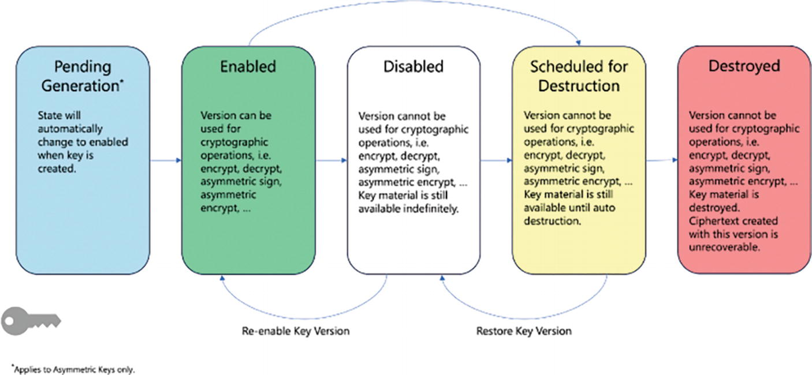

# Chapter 4. Ensuring Data Protection

Data protection consists of three building blocks:

- Data confidentiality: to protect the data that needs protection and prevent access to unauthorized individuals.

- Data integrity: to ensure the data has not been altered in an unauthorized manner.

- Data availability. to make sure data is accessible to authorized users when and where it is needed and in the form and format that is required.

Google Cloud offers a broad spectrum of services to protect data in any phase of its lifecycle: creation, storage, use, share, archival, and disposal.

In this chapter, you will learn how to use the *GCP Sensitive Data Protection* ecosystem (formerly known as the *Data Loss Prevention* (DLP) API) to protect your workload’s sensitive data at rest, in use, and in transit.

## Protecting Sensitive Data and Preventing Data Loss

<details><summary style="color:Maroon;font-size:16px;">Show Contents</summary>

### Overview

<details><summary style="color:Maroon;font-size:16px;">Show Contents</summary>

*De-identification* is the process of removing identifiable information from your data. Common examples include personally identifiable information (PII), such as First/last name, 
Phone number, Mailing/email address, Credit card number, and etc.

De-identification can intelligently detect sensitive information and use a number of de-identification transformation techniques to delete, mask, tokenize, or otherwise obscure the sensitive data.

Which de-identification transformation technique to use depends largely on two factors: data type, and purpose.

- *Data type* drives the de-identification transformation because each data type holds data differently. For example, if we are trying to de-identify dates, we can leverage a data shifting technique that changes the date by adding a random interval of time. To de-identify images that contain sensitive data, we can apply image redaction that can recognize optical characters and masks them with an opaque rectangle.

- The *purpose* also determines the most suitable de-identification technique. Some techniques will completely hide the sensitive data (e.g., redaction), while others will still allow you to extract important information about the data.

The following diagram shows several de-identification techniques and their data obsfication level vs information about the data.


The *masking* technical will substitute each character of the data with a special character such as `*` or `#`. Masking would transform the string `1234-5678-4321-8765` into the string `*******************`.

Using *replacement*, we replace the entire string with something else, for example, its corresponding sensitive information type (or *infoType*). As a result, the same string would be transformed into something like [CREDIT_CARD_NUMBER]. (For a complete list of infoTypes, visit https://cloud.google.com/dlp/docs/infotypes-reference.)

With masking, we don’t know what type of sensitive data is hidden. With replacement, we still cannot decipher the data, but at least we know it’s a credit card number.

*Bucketing* is a technical to generalize distinguishing values in the sensitive data based on custom values or ranges. For example, the following table shows salary information for each job title. In this case, the job title is a piece of sensitive data. If there is only one individual holding the job title of VP Engineering, then everyone would know how much he or she makes. Bucketing replaces the job title with a more general attribute that makes it harder to discover. By applying bucketing, we are still able to use the financial data without putting at risk the employee’s privacy.

| Job Title | Salary |
| - | - |
| ~~VP Engineering~~ **Executive** | 250K |
| ~~VP Security~~ **Executive** | 250K |
| ~~VP Architecture~~ **Executive** | 250K |
| ~~Director Architecture~~ **Director** | 200K |
| ~~Director Security~~ **Director** | 200K |
| ~~Principal Engineer~~ **Engineer** | 150K |
| ~~Senior Engineer~~ **Engineer** | 140K |

Another powerful de-identification technique is crypto-based tokenization or simply tokenization. Tokenization technique securely encrypts sensitive data by using a cryptographic key and replaces the sensitive data with a token. Cloud DLP supports several types of tokenization, including some that are reversible, so that you can re-identify the de-identified data (token).

The following table shows data from a ticketing system, which was imported to a BigQuery dataset. As you can see, column “description” shows PII de-identified data using the replacement technique, whereas column “userid” shows PII de-identified data using tokenization.

| userid | date | description |
| - | - | - |
| `Qx7th+DncCysk=jukP4Jnkf/btg6/kiu7a=` | 2023-11-19 | Refund to `[CREDIT_CARD_NUMBER]` |
| `biDujuUp/abdH6Jisbcgs=qRftecjdSyhy=` | 2023-11-20 | Update `[PHONE_NUMBER]` |
| `Qx7th+DncCysk=jukP4Jnkf/btg6/kiu7a=` | 2023-11-21 | Lost `[CREDIT_CARD_NUMBER]` |
| `Qx7th+DncCysk=jukP4Jnkf/btg6/kiu7a=` | 2023-11-10 | Activate `[CREDIT_CARD_NUMBER]` |
| `Qx7th+DncCysk=jukP4Jnkf/btg6/kiu7a=` | 2023-11-21 | Freeze `[CREDIT_CARD_NUMBER]` | 
| `biDujuUp/abdH6Jisbcgs=qRftecjdSyhy=` | 2023-11-20 | Update `[STREET_ADDRESS]` |

The values in the “userid” column are unrecognizable. Yet, if we run a SQL query such as
```sql
SELECT userid, count(*) FROM `ticket-dataset.*` GROUP BY userid
```
we can see how many tickets are assigned to each unique user in the system.

This is accomplished without revealing the user identifier. As a result, this report can be used for data analysis without the risk of compromising the privacy of each user.

Additionally, the user identifiers can be re-identified by principals who have been authorized to access the cryptographic key, which was used to tokenize the values in the first place. 

Whether to protect an entire dataset of sensitive data or specific parts of this dataset, Cloud DLP offers a broad number of de-identification solutions so that you will not be forced to use a one-size-fits-all policy for all the PII.

Combining IAM with Cloud DLP, you can even increase the degree of access control sophistication by cherry-picking which IAM role is allowed to de-identify a specific “piece” of your sensitive data.

</details>

### Data De-identification Process

<details><summary style="color:Maroon;font-size:16px;">Show Contents</summary>

The process to de-identify sensitive data involves three steps in the following order:

1. *Where (discover)*: Determine where the sensitive data is located, for example, in a photo, in a PDF document, in a text message, in an email, in a word document, in a voicemail, and so on.

2. *What (detect)*: Determine what sensitive data to de-identify, for example, a credit card number, a phone number, a US social security number, and so on.

3. *How (protect)*: Choose how to de-identify the detected sensitive data, for example, completely redact it, mask it, irreversibly replace it with a surrogate token, and so on.

For step 1, you need to consider not only the actual entity that contains the sensitive data but also the service that stores such entity. The approach to protect sensitive data in objects stored in a Google Cloud Storage (GCS) bucket may differ from the approach for  the same data stored in a Cloud SQL for MySQL database.

Step 2 is essentially the detection process, where you tell Cloud DLP what type of sensitive data element—also known as infoType—you want to detect (and subsequently protect). These infoTypes come in two different “flavors”:

- Built-in infoTypes

- Custom infoTypes

*Built-in infoTypes* are already created by Google, and their detectors are ready for use out of the box. They include detectors for country or region-specific, as well as globally applicable sensitive data types. One of the examples is the government ID number for a specific country.

*Custom infoTypes* are sensitive information types that you create and are derived by your specific data protection use cases. These can be based on a data dictionary that you define or a pattern that matches a regular expression, also defined by you. You can further fine-tune scan results using inspection rules, which can be

- *Hotword rules*: enable you to increase the number of matches returned. These rules can also change the likelihood of a matched value.

- *Exclusion rules*: enable you to decrease the number of matches returned.

Step 3 focuses on the “how” you want to protect your sensitive data upon discovery. There are multiple ways to protect detected sensitive data. Your specific use case will drive the decision of which approach is best suited. Here are some of the questions you need to answer that will help you select the best option:

- Do you need to completely redact the detected sensitive data, or a replacement indicating the data type will suffice?

- Do you need to perform queries and analytics on your data upon de-identification?

- Do you need to re-identify your data upon de-identification?

- Do you need to de-identify unstructured sensitive data (e.g., a PNG image)?

The format also plays a role in the de-identification process. If the data is structured and stored in a relational database table, you need to decide whether the entire table (or even the entire database) or just the column that matched a detected infoType need to be protected. To address the format, Cloud DLP can perform the protection at the infoType level or at the entire record level. 

The following is a list of commonly used techniques to perform data de-identification. 

1. *Redact* redacts sensitive data using a `redactConfig` configuration.
 
2. *Replace* replaces sensitive data with a string of your choice using a `replaceConfig` configuration.

3. *Character mask* partially masks a string by replacing a given number of characters with a fixed character using a `characterMaskConfig` configuration.

4. *Crypto hash* performs tokenization (also referred to as pseudonymization) on an input value by using a `cryptoHashConfig` configuration that replaces the detected sensitive data with a surrogate value using cryptographic hashing

5. *Date shift* performs date shifting on a date input value by shifting the dates by a random number of days using a `dateShiftConfig` configuration
 
</details>

### Inspecting and Redacting Personally Identifiable Information (PII) from Text
<details><summary style="color:Maroon;font-size:16px;">Show Contents</summary>

*Use case*: programmatically detect, mask, or redact personally identifiable information (PII)

*Solution*: leveraging the DLP API

The samples we just downloaded include a main.go source file that contains the calls to the method(s) we use to redact PII data.

Additionally, the main.go file contains a variable var section, where we specify the infoType strings we want to inspect and de-identify using one of the techniques you learned before. Currently, this list includes PHONE_NUMBER, EMAIL_ADDRESS, CREDIT_CARD_NUMBER, and US_SOCIAL_SECURITY_NUMBER.

Let’s edit the main.go by adding to the infoType list STREET_ADDRESS and VEHICLE_IDENTIFICATION_NUMBER as shown in Figure 4-10.

Figure 4-10Editing the infoType list
The bottom part of Figure 4-10 displays the go build command, which we executed after saving the changes. This command is used to compile the source files into a binary, executable file dlp that can be run anytime without further processing.

We can now use the dlp Go binary to redact PII data in multiple ways, as per the following synopsis:
./dlp -project <my-project> [flags] subcommand [args]
The required flag is
-project string: This flag denotes the Google Cloud project ID.

The optional flags can be any of these:
-bytesType string from a list: This flag denotes the bytes type of the input file for the inspectFile and redactImage subcommands (methods). A valid string can be one of IMAGE_SVG, TEXT_UTF8, BYTES_TYPE_UNSPECIFIED (default), IMAGE_JPEG, IMAGE_BMP, or IMAGE_PNG.

-includeQuote boolean: This flag indicates whether a quote should be included in the results to be inspected. It defaults to false.

-infoTypes string: This flag indicates the infoTypes to inspect and applies to the following subcommands: redactImage, createTrigger, and createInspectTemplate. By default, these strings are already preselected for you: PHONE_NUMBER, EMAIL_ADDRESS, CREDIT_CARD_NUMBER, US_SOCIAL_SECURITY_NUMBER.

-languageCode string: This flag denotes the language code for infoTypes. It defaults to “en-US”.

-maxFindings integer: This flag denotes the number of results for the following subcommands: inspect* (i.e., all subcommands whose prefix is “inspect”), createTrigger, and createInspectTemplate. It defaults to zero (no limit).

-minLikelihood string from a list: This flag denotes the minimum likelihood value for the following subcommands: inspect*, redactImage, createTrigger, and createInspectTemplate. A valid string can be one of LIKELY, VERY_LIKELY, LIKELIHOOD_UNSPECIFIED (default), VERY_UNLIKELY, UNLIKELY, or POSSIBLE.

Let’s start with a simple example, and say we want to inspect the following string with dummy data:

“My SSN is 123456789 and my phone number is (123) 456-7890”

The dlp Go program can achieve just that by simply using the inspect subcommand, as illustrated in Figure 4-11.

Figure 4-11Inspecting PII data from text
The Go dlp program returns the formatted results of a call to the DLP API. Here are a few points to highlight:
1.	
Three findings were returned.

 
2.	
The first finding starts at byte 10 and ends at byte 19. This finding was mistakenly recognized as a possible PHONE_NUMBER infoType, even though the string clearly indicates it’s a Social Security Number (SSN). After all, this finding “123456789” could look as (non-US) phone number. The sensitivity for this PHONE_NUMBER infoType is SENSITIVITY_MODERATE, and its likelihood shows as LIKELY.

 
3.	
The second finding also starts at byte 10 and ends at byte 19. This finding was correctly recognized as a possible US_SOCIAL_SECURITY_NUMBER infoType. The sensitivity for this US_SOCIAL_SECURITY_NUMBER infoType is SENSITIVITY_HIGH, which makes sense, and its likelihood shows as LIKELY.

 
4.	
The third finding starts at byte 43 and ends at byte 57. This finding was correctly recognized as a possible PHONE_NUMBER infoType. The sensitivity for this PHONE_NUMBER infoType is SENSITIVITY_MODERATE, which also makes sense, and its likelihood shows as VERY_LIKELY.

 
As you can see in the example in Figure 4-11, the DLP API has built-in logic to determine what looks like an infoType based on its format. In fact, when a phone number is properly formatted in accordance with the US format, the DLP API returns a very likely match (see bullets 2 and 4).

Let’s try another simple example, and say we want to inspect the following string with dummy data:

“My SSN is 123-45-6789 and my phone number is (123) 456-7890”

Figure 4-12 shows the results when we fed the previous text to the dlp program.

Figure 4-12Inspecting PII data from formatted text
With a little help, the dlp program correctly returned only two findings:
1.	
The first finding starts at byte 10 and ends at byte 21. This finding was correctly recognized as a very likely US_SOCIAL_SECURITY_NUMBER infoType. The sensitivity for this US_SOCIAL_SECURITY_NUMBER infoType is SENSITIVITY_HIGH, and its likelihood shows as VERY_LIKELY.

 
2.	
The second finding starts at byte 45 and ends at byte 59. This finding was correctly recognized as a very likely PHONE_NUMBER infoType. The sensitivity for this PHONE_NUMBER infoType is SENSITIVITY_MODERATE, and its likelihood shows as VERY_LIKELY.

 
The examples in Figures 4-11 and 4-12 illustrated the ability of the DLP API to inspect sensitive data. The upcoming two examples will demonstrate how to de-identify sensitive data.

Figure 4-13 shows how to mask the discovered two infoTypes.

Figure 4-13Masking PII data from formatted text
As you can see, the Social Security Number and the phone number have been completely masked with sequences of * characters. Notice that the mask function preserves the length of the string to be de-identified.

Figure 4-14 shows how to de-identify dates by using the date shift function.

Figure 4-14Date-shifting PII data from formatted text
The original date has been transformed into another date—December 23, 2023.

Inspecting and Redacting Personally Identifiable Information (PII) from Images
The use case described in the previous example can include the transmission of sensitive data captured in nonstructured formats. For example, PII data can be present in an electronic bill, which can be shared as a PDF (Portable Document Format) document or as a PNG (Portable Network Graphics) image.

Regardless of the format, you still wouldn’t want your PII (or PHI) data in the wrong hands. This is because a bad actor with access to your PII data could steal your identity.

In the next two examples, you will learn how to use the DLP API to programmatically redact PII data from images. Figure 4-15 shows you how the ./dlp Go program can be invoked with the -bytesType flag set to IMAGE_PNG to redact a configurable set of infoTypes from an image. The infoType configuration is displayed in Figure 4-10 at line 42.

Figure 4-15Using a Go program to redact PII data from an image
As you can see from Figure 4-16 the ./dlp Go program redacts the STREET_ADDRESS, and PHONE_NUMBER infoTypes.

Figure 4-16An image with PII data before and after redaction
Figure 4-17 shows you how the ./dlp Go program can be invoked with the same flag but using a different image.

Figure 4-17Using a Go program to redact PII data from an image
As you can see from Figure 4-18 the ./dlp Go program redacts the STREET_ADDRESS, EMAIL_ADDRESS, PHONE_NUMBER and VEHICLE_IDENTIFICATION_NUMBER infoTypes, as expected given the configuration displayed in Figure 4-10 at line 42.

Figure 4-18An image with PII data before and after redaction
Configuring Tokenization (Pseudonymization)
Crypto-based tokenization (also referred to as “pseudonymization”) transformations are de-identification methods that replace the original sensitive data values with encrypted values. Sensitive Data Protection supports the following types of tokenization, including transformations that can be reversed and allow for re-identification:
1.	
Cryptographic hashing: Given a CryptoKey, Sensitive Data Protection uses a SHA-256-based message authentication code (HMAC-SHA-256) on the input value and then replaces the input value with the hashed value encoded in base64. Unlike other types of crypto-based transformations, this type of transformation isn’t reversible.

 
2.	
Format-preserving encryption (FPE): Replaces an input value with a token that has been generated using format-preserving encryption (FPE) with the FFX (Feistel Finite eXchange) mode of operation. This transformation method produces a token that is limited to the same alphabet as the input value and is the same length as the input value. FPE also supports re-identification given the original encryption key.

Note If you like mathematics and are curious to find out more about the FFX mode of operation for format-preserving encryption, you can read the full specification by visiting https://csrc.nist.gov/csrc/media/projects/block-cipher-techniques/documents/bcm/proposed-modes/ffx/ffx-spec.pdf.
 
3.	
Deterministic encryption: Replaces an input value with a token that has been generated using AES in Synthetic Initialization Vector mode (AES-SIV). This transformation method has no limitation on supported string character sets, generates identical tokens for each instance of an identical input value, and uses surrogates to enable re-identification given the original encryption key.

 
NoteWhen you use Cloud KMS for cryptographic operations, charges apply. In addition, when you use a Cloud HSM key or a Cloud EKM key, you consume Cloud KMS quota on the project that contains the key. In contrast, if you're using a software Cloud KMS key with Sensitive Data Protection, no quota limits apply. For more information, see Quotas in the Cloud KMS documentation.
Figure 4-19 shows a comparison among the three types of tokenization techniques.

Figure 4-19Comparing tokenization techniques
Configuring Format-Preserving Encryption (FPE)
The format-preserving encryption (FPE) transformation method (CryptoReplaceFfxFpeConfig in the DLP API) takes an input value (a piece of sensitive data that Sensitive Data Protection has detected), encrypts it using format-preserving encryption in FFX mode and a CryptoKey, and then replaces the original value with the encrypted value, or token.

The input value
Must be at least two characters long (or the empty string).

Must be encoded as ASCII.

Comprised of the characters specified by an “alphabet,” which is a set between 2 and 95 allowed characters in the input value. For more information, see the alphabet field in the CryptoReplaceFfxFpeConfig API reference by visiting https://cloud.google.com/sensitive-data-protection/docs/reference/rest/v2/projects.deidentifyTemplates#cryptoreplaceffxfpeconfig.

The generated token
Is the encrypted input value.

Preserves the character set (“alphabet”) and length of the input value post encryption.

Is computed using format-preserving encryption in FFX mode keyed on the specified cryptographic key.

Isn’t necessarily unique, as each instance of the same input value de-identifies to the same token. This enables referential integrity and therefore enables more efficient searching of de-identified data. You can change this behavior by using context “tweaks,” as described in Contexts at https://cloud.google.com/sensitive-data-protection/docs/pseudonymization#tokenized_value_comparison.

If there are multiple instances of an input value in the source content, each one will be de-identified to the same token. FPE preserves both length and alphabet space (the character set), which is limited to 95 characters. You can change this behavior by using context “tweaks,” which can improve security. The addition of a context tweak to the transformation enables Sensitive Data Protection to de-identify multiple instances of the same input value to different tokens. If you don’t need to preserve the length and alphabet space of the original values, use deterministic encryption, described as follows.

Sensitive Data Protection computes the replacement token using a cryptographic key. You provide this key in one of three ways:
1.	
By embedding it unencrypted in the API request. This is not recommended.

 
2.	
By requesting that Sensitive Data Protection generate it.

 
3.	
By embedding it encrypted in the API request.

 
If you choose to embed the key in the API request, you need to create a key and wrap (encrypt) it using a Cloud Key Management Service (Cloud KMS) key. For more information, see “Creating and managing encryption keys for CMEK, CSEK, and EKM” later in the chapter. The value returned is a base64-encoded string by default. To set this value in Sensitive Data Protection, you must decode it into a byte string.

De-identifying and Re-identifying Personally Identifiable Information (PII) with Format-Preserving Encryption
In this exercise, we will be using the Sensitive Data Protection (formerly known as Data Loss Prevention—DLP) API to perform de-identification and re-identification of PII data with format-preserving encryption (FPE) from a text. While we used the DLP Go libraries in the previous exercise, it is equally important you get familiarized with the actual Sensitive Data Protection API.

Ultimately, the Google Cloud console, the gcloud CLI, and all the major runtimes provided by Google Cloud translate your requests into API calls.

As you learned previously, Sensitive Data Protection computes the replacement token using a cryptographic key. This computation starts with the generation of a token that will replace the PII data during the de-identification process—also known as tokenization. Conversely, this computation ends with the restore of the original PII data during the re-identification process—also known as de-tokenization.

Both tokenization and de-tokenization require the use of a cryptographic key that will be used to tokenize and de-tokenize the PII data you want to protect. It is best practice to further protect—or to wrap—this cryptographic key by using a Cloud Key Management Service (Cloud KMS) key.

NoteFor development purposes, the Cloud KMS key protection level (as specified by the --protection-level gcloud flag) can be software to indicate that the physical environment where crypto operations with the key happen is software defined. However, for production environments, it is best practice to set the protection level of this Cloud KMS key to hsm, to create a hardware-backed key (in a hardware security module). Other options include external and external-vpc to indicate the crypto operations leverage an externally backed key or an external key over VPC, respectively.
With these guidelines, we are off to a great start. This example is comprised of five steps.

Step 1: Creating a Cloud KMS Key Ring and a Key

First and foremost, we need to decide and remember the region where we want Sensitive Data Protection to process our tokenization and de-tokenization requests.

Exam TipWhen a Cloud KMS key is created, it must be stored in either global or in the same region where we will issue Sensitive Data Protection requests. Otherwise, the Sensitive Data Protection requests will fail. To view a list of supported Sensitive Data Protection locations, visit https://cloud.google.com/dlp/docs/locations.
Figure 4-20 shows the gcloud command to create a key ring by using global as the location for all API requests. If you want to use a different region, replace global with the region name. For more information about KMS locations, visit https://cloud.google.com/kms/docs/locations.

Figure 4-20Creating a key ring
As you may have noticed, I forgot to enable the Cloud KMS API in my default project. However, the gcloud CLI was kind enough to prompt me and saved me from typing the gcloud services enable command to enable the Cloud KMS API.

With a key ring, we have a resource to store our Cloud KMS key. Figure 4-21 illustrates the gcloud command to create a symmetric, software key.

Figure 4-21Creating a software, symmetric Cloud KMS key
Next, we need to get the newly created key full resource name. Figure 4-22 shows you in the bottom right how to get this value (highlighted)—by using the gcloud command gcloud kms keys list.

Figure 4-22Getting the Cloud KMS key full resource name
Step 2: Creating a Base64-Encoded AES Key

In this step, we create the cryptographic key that will be used to encrypt our actual PII data. To do that, we are going to use the openssl rand command, which leverages a cryptographically secure pseudorandom number generator. Since the output of this command is binary, we need to base64-encode the output so that it will be converted into a string of bytes.

First, let’s create a directory where to store our cryptographic keys:
mkdir keys
cd keys
Next, let’s create the key.

In Figure 4-23, we used the -base64 flag to base64-encode the raw key. Without doing so, the produced key would be in binary format.

Figure 4-23Creating a base64-encoded AES key
CautionDo not use this example key to protect actual sensitive data. This key is provided only to serve as an example. Because it's shared here, this key is not safe to use.
Step 3: Wrapping the AES Key Using the Cloud KMS Key

This section describes how to use the Cloud KMS key that you created in step 1 to wrap the base64-encoded AES key that you created in Figure 4-23.

Figure 4-24 illustrates how we leverage the Sensitive Data Protection API to post the base64-encoded AES key to the Cloud KMS API with the curl command. This request will wrap the base64-encoded AES key with the Cloud KMS key we created in Figure 4-21.

Figure 4-24Wrapping the AES key with the Cloud KMS key
This key is enclosed in the green rectangle.

The wrapped AES key is the value of the ciphertext property returned in the response and is shown in the blue rectangle in Figure 4-24. We will need this value in step 4 to de-identify our sensitive data. To ensure this value doesn’t get lost, we stored it in a file wrapped_aes_key.enc.

Step 4: Preparing the Request for the DLP API

We will be using the projects.content.deidentify method as defined in the reference DLP API page: https://cloud.google.com/dlp/docs/reference/rest/v2/projects.content/deidentify.

The request for the DLP API must be formatted in accordance with a well-defined structure. If you are familiar with the JavaScript Object Notation (JSON), the exact syntax of this request can be found at https://cloud.google.com/dlp/docs/reference/rest/v2/projects.content/deidentify#request-body.

Let’s create this JSON document in its own templates folder:
cd ..
mkdir templates
Figure 4-25 shows the JSON document that we will be posting to the DLP endpoint to de-identify the string “My car VIN is: 1HGBH41JXMN109186.”

We saved this file in the templates folder as deid_fpe_request.json.

NoteIf you are curious to learn more about the vehicle identification number, visit https://en.wikipedia.org/wiki/Vehicle_identification_number.

Figure 4-25Viewing the de-identification request document
There are several observations to mention:
The JSON document itself contains information about the inspection and the transformation type. We are inspecting vehicle identification numbers, as specified in the inspectConfig body element in line 29, and we are requesting a primitive transformation, whose type is format-preserving encryption (FPE)—cryptoReplaceFfxFpeConfig element in line 12—with a cryptographic key.

The arrow in Figure 4-25 indicates where the ciphertext for the wrapped AES key should be placed (line 15).

The full key resource name is the value of the cryptoKeyName element in line 16.

The surrogateInfoType element in line 19 is used to inform the DLP API what token should be used to replace the matched infoType. By using the name “VEHICLE_IDENTIFICATION_NUMBER_TOKEN” we are telling the DLP API to replace any occurrence of a matched vehicle identification number with a string obtained by concatenating the token “VEHICLE_IDENTIFICATION_NUMBER_TOKEN” with the length of the match (17 uppercase alphanumeric characters) and the result of the FPE encryption.

An alphabet is required. Per the cryptoReplaceFfxFpeConfig specification, it can be a common alphabet or a custom alphabet, and its possible values are character sets of these types: ALPHA_NUMERIC, NUMERIC, HEXADECIMAL, UPPER_CASE_ALPHA_NUMERIC. Since vehicle identification numbers use the UPPER_CASE_ALPHA_NUMERIC character set, we chose to use a commonAlphabet with value UPPER_CASE_ALPHA_NUMERIC. Regardless, the result of the FPE transformation will preserve the character set being used, as well as the format and the length of the matched infoType, in this case a VEHICLE_IDENTIFICATION_NUMBER. For more information, visit https://cloud.google.com/dlp/docs/reference/rest/v2/projects.deidentifyTemplates#ffxcommonnativealphabet.

Step 5: Tokenizing PII Data

The curl request is shown in the following snippet. We are good to go!
curl \
"https://dlp.googleapis.com/v2/projects/evocative-hour-351120/locations/global/content:deidentify" \
--request "POST" \
--header "Authorization:Bearer $(gcloud auth application-default print-access-token)" \
--header "content-type: application/json" \
--header "x-goog-user-project: evocative-hour-351120" \
--data "@./templates/deid_fpe_request.json"
The response is displayed in Figure 4-26.


Figure 4-26De-identifying a VIN number with FPE
NoteThe default project setting (evocative-hour-351120) doesn’t apply to direct API calls to Google Cloud. As a result, the HTTP request header "x-goog-user-project: evocative-hour-351120" is required to tell the DLP API which project needs to be billed for this request.
In Figure 4-26, the result of the transformation is highlighted. The matched vehicle identification number is replaced by a string obtained by concatenating the token “VEHICLE_IDENTIFICATION_NUMBER_TOKEN” with the length of the match (17 uppercase alphanumeric characters) and the result of the FPE encryption.

Before tokenization:
"My car VIN is: 1HGBH41JXMN109186."
After tokenization:
"My car VIN is: VEHICLE_IDENTIFICATION_NUMBER_TOKEN(17): DXC78ROULMEUNDL97."
Exam TipFormat-preserving encryption (FPE)—just like deterministic encryption—is a deterministic form of transformation. This means if you repeat the transformation with the same input and the same wrapped AES key, you will get the same result. See the table in Figure 4-19 for a detailed comparison.
As you can see in Figure 4-26, the response includes
1.	
The wrapped (encrypted and base64 encoded) AES key: Make sure the actual AES key is properly secured because if it goes in the wrong hands, the tokenized data can easily be re-identified by a bad actor. This is exactly why we had to wrap this key in the beginning.

 
2.	
The Google Cloud KMS cryptographic key full resource name: This key is used to encrypt the actual AES key (in base64 format) we created in step 1. This key never leaves Google Cloud. As a result, this key is virtually secure.

 
In the next two steps, we will perform the following:
Inspection: We will inspect the tokenized vehicle identification number highlighted in Figure 4-26 to make sure its surrogateInfoType (lines 19–21 in Figure 4-25) is properly detected by the DLP API for re-identification purposes.

Re-identification: Upon successfully detecting the tokenized vehicle identification number, we will re-identify it to its original, sensitive data. As you may have guessed, you will need the wrapped AES key to de-tokenize the data. Without the wrapped AES key, the data cannot be re-identified. This is why you should store your AES key in a safe location and make sure only authorized principals can access it.

Step 6: Inspecting the Tokenized Vehicle Identification Number

The JSON document to request inspection of sensitive data with the Sensitive Data Protection (DLP) API is much simpler than the one to de-identify sensitive data. This makes sense because the process to inspect data—in a way—is read-only. The API only reads the input data and returns zero or more findings if the JSON document is syntactically valid. The API doesn’t perform any transformation on the data. As a result, there is no infoTypeTransformations section.

Figure 4-27 shows the JSON document on the top of the page and the curl command along with the returned response at the bottom.
curl \
https://dlp.googleapis.com/v2/projects/evocative-hour-351120/locations/global/content:inspect \
--request "POST" \
--header "Authorization:Bearer $(gcloud auth application-default print-access-token)" \
--header "content-type: application/json" \
--header "x-goog-user-project: evocative-hour-351120" \
--data "@./templates/inspect_fpe_request.json"

Figure 4-27Inspecting a tokenized VIN number with FPE
Notice that in this request we are telling the DLP API we want to inspect our text in search of tokenized VIN numbers, not just “regular” VIN numbers.

As you learned in step 5, an example of a tokenized VIN number is
VEHICLE_IDENTIFICATION_NUMBER_TOKEN(17): DXC78ROULMEUNDL97
On the other hand, an example of a “regular” VIN number is
1HGBH41JXMN109186
The former comes prefixed with the actual token VEHICLE_IDENTIFICATION_NUMBER_TOKEN(17), which includes the length of characters that were replaced. The token is then concatenated with the format-preserving encrypted data DXC78ROULMEUNDL97.

The latter is the real, bare, original VIN number. No “artificial” tokens are included. No data is encrypted with format-preserving encryption.

Figure 4-27 shows the details of the finding(s). Pay attention in particular to the location of the finding, as noted with arrows pointing to the start and the end of the match—characters 15 and 72, respectively.

Now that we know that the inspection of a tokenized VIN number works, we are ready to de-tokenize our data.

Step 7: De-tokenizing Encrypted PII Data

Figure 4-28 illustrates the JSON document to re-identify our tokenized VIN number. There are three differences when comparing this JSON document with its de-identification companion. These are the following:
1.	
The main element is reidentifyConfig (line 2 in Figure 4-28).

 
2.	
The infoType transformation is VEHICLE_IDENTIFICATION_NUMBER_TOKEN (line 8 in Figure 4-28).

 
3.	
The inspectConfig element (line 29 in Figure 4-28) targets customInfoTypes (line 35 in Figure 4-28), whose first (and only) in its list is VEHICLE_IDENTIFICATION_NUMBER_TOKEN (line 38 in Figure 4-28).

 
The first difference is obvious.

The second difference makes sense, if you think about it. After all, during re-identification we are looking to transform tokenized VIN numbers into plaintext (or “regular,” as we called them before) VIN numbers. As a result, the inspection must target our VEHICLE_IDENTIFICATION_NUMBER_TOKEN custom InfoType.

Figure 4-28Viewing the re-identification request document
Now that you understood the structure and the content of the JSON request, here is our curl command:
curl "https://dlp.googleapis.com/v2/projects/evocative-hour-351120/locations/global/content:reidentify" \
--request "POST" \
--header "Authorization:Bearer $(gcloud auth application-default print-access-token)" \
--header "content-type: application/json" \
--header "x-goog-user-project: evocative-hour-351120" \
--data "@./templates/reid_fpe_request.json"
The output of this command is displayed in Figure 4-29, with our original VIN number highlighted.

The last observation to recall is that just like to de-identify data with tokenization we must use a cryptographic key—according to best practices—a wrapped cryptographic key; the same applies to re-identify data.

This is one more reason to reiterate that the protection of the cryptographic key is as important as the protection of your sensitive data. This is why we wrapped this key in step 3, by leveraging Cloud KMS.

Figure 4-29Re-identifying a tokenized VIN number with FPE
Exam TipThe inspectConfig section in the deid_fpe_request.json is different from the reid_fpe_request.json. If you noticed, the latter includes a customInfoType definition, which essentially tells the DLP API we are after tokenized VIN numbers.
Restricting Column Access to BigQuery Datasets
When data is stored in columns, it is possible to go a step further and enforce access control with different levels of protection at the column level. In this section, you will learn how to accomplish this task with BigQuery.

You can restrict access to columns containing sensitive data in a BigQuery dataset by associating policy tags to these columns. This BigQuery feature is called column-level access control and lets you create policies that check—at query time—whether a user has proper access to the sensitive data in the column. For example, a policy can enforce access control such as the following:

You must be a member of the group gcp-data-protection-admins@dariokart.com to see the columns containing TYPE_SSN.

Policy tags and taxonomies are the entities used to configure column-level security in BigQuery.

Column-level access control can also be supplemented with Dynamic Data Masking (DDM) to provide an extra layer of defense in depth. Dynamic Data Masking lets you mask sensitive data by replacing null, default, or hashed content in place of the column’s actual value.

Exam TipWith BigQuery, all your data (including objects and metadata) are encrypted at rest by default with Advanced Encryption Standard (AES). Google manages the cryptographic keys on your behalf. You can also choose to manage your own cryptographic keys in other ways, for example, by using customer-managed encryption keys (CMEK), as you will learn later in this chapter. Regardless of the technique used to encrypt your data at rest, a user who has access to your BigQuery sensitive dataset can still access your sensitive data. As a result, without tokenization your sensitive data could still be exposed to loss and exfiltration. That’s where Dynamic Data Masking comes into play. Dynamic Data Masking can mitigate the risk of data loss by masking the results returned by a query based on column-level access control.
In the next section, we will deep dive into column-level access control with a typical use case. Let’s take a look!

Column-Level Access Control Deep Dive
In this use case, we will create a simple BigQuery dataset with a table that stores sensitive data in four columns:
1.	
Full Name

 
2.	
Date of Birth (DOB)

 
3.	
Email

 
4.	
US Social Security Number (SSN)

 
This dataset will be consumed by the frontend of an application, which uses the service account joseph-sa-1@evocative-hour-351120.iam.gserviceaccount.com we created in Chapter 2. For the sake of focus on data protection, we will not build the application. Instead, we will simulate calls on behalf of the service account to read data from this dataset.

Typically, application service accounts have elevated privileges to a data store as a means to fulfill business requirements.

Think of this application as a system to manage PII data. This system will require read and write access to the dataset, without the need to alter the structure of tables, views, or other dataset objects.

However, the data administrator—which can directly query the data without using the application frontend—won’t need the ability to read the sensitive data.

After all, the owner of the sensitive data is the business application service account, not the data administrator. Yet, the data administrator should be allowed to perform Data Definition Language (DDL) operations on dataset objects, for example, create/alter/drop tables, views, and so on.

In this example, the principal joseph-sa-1@evocative-hour-351120.iam.gserviceaccount.com will act as the application service account, whereas the principal joseph@dariokart.com will act as the data(base) administrator.

First, let’s log in as joseph@dariokart.com and let’s create the BigQuery dataset and the table. This principal has the owner role on the project. Therefore, they have enough permissions to create the dataset.

Use the gcloud services enable bigquery.googleapis.com to enable the BigQuery API:
bq --location=us-central1 mk -d \
    --default_table_expiration 86400 \
    --description "This dataset contains PII data." \
    sensitive_dataset
bq mk \
    -t \
    --expiration 86400 \
    --description "This table contains PII data." \
    --label organization:infosec \
    sensitive_dataset.pii_table \
    fullname:STRING,dob:DATE,email:STRING,ssn:STRING
In Figure 4-30, we use the bq built-in command to create the dataset and the table. This command comes with the gcloud CLI and is extremely helpful to use the BigQuery service. For more information, visit the reference guide at https://cloud.google.com/bigquery/docs/reference/bq-cli-reference.

Figure 4-30Creating a BigQuery dataset and a table
NoteThe dataset has been created with a default table expiration duration of 86,400 seconds, that is, 1 day. Don’t store important data; otherwise, it will be destroyed after one day.
Let’s now populate this table with the CSV (comma-separated values) file displayed in Figure 4-31.

Figure 4-31A CSV file to populate our table
bq load --skip_leading_rows=1 \
    --source_format=CSV \
    sensitive_dataset.pii_table \
    ./bigquery/pii_data.csv
Figure 4-32 shows the output of the preceding command.

Figure 4-32Loading data into our table from a CSV file
Figure 4-33 confirms the data has been properly loaded into the table.
bq query \
    --use_legacy_sql=false \
    'SELECT * FROM `sensitive_dataset.pii_table`'

Figure 4-33Selecting data from table
Next, we need to grant read and write permissions to our service account on this table. To do so, we need to operate as follows:
1.	
Log in as a user with permissions to assign IAM roles to other identities.

 
2.	
Get the IAM allow policy for the sensitive_dataset.

 
3.	
Edit the IAM allow policy by granting joseph-sa-1@evocative-hour-351120.iam.gserviceaccount.com the IAM roles to read from and write to the dataset.

 
4.	
Save the changes.

 
For item 1, we can log in as gianni@dariokart.com. This principal has the Organization Admin role as a result of being a member of the gcp-organization-admins@dariokart.com group.

For item 2, we can run this command:
bq show \
   --format=prettyjson \
   evocative-hour-351120:sensitive_dataset \
> ./bigquery/sensitive_dataset_iam_policy.json
In Figure 4-34, we used cloud shell after logging in as gianni@dariokart.com, and we saved the IAM allow policy for the dataset in a JSON file.

Figure 4-34Getting IAM allow policy for the dataset
Figure 4-35 shows the file with the editor vi.

Figure 4-35Viewing IAM allow policy for the dataset
For item 3, let’s update the dataset IAM policy as shown in Figure 4-36.

Figure 4-36Updating the IAM allow policy for the dataset
Finally, we can apply the new IAM allow policy to the dataset with this command:
bq update \
--source ./bigquery/sensitive_dataset_iam_policy.json \
evocative-hour-351120:sensitive_dataset
whose result is displayed in Figure 4-37.

Figure 4-37Failing to apply IAM allow policy for the dataset
The command failed because the principal gianni@dariokart.com needs the bigquery.datasets.update permission, which can be found—for example—in the roles/bigquery.dataOwner IAM role.

Upon granting such role, as shown and confirmed in Figures 4-38 and 4-39, the command succeeded, as shown in Figure 4-40.

Figure 4-38Granting the dataOwner role to gianni in evocative-hour-351120

Figure 4-39Validating the dataOwner role to gianni in evocative-hour-351120

Figure 4-40Applying IAM allow policy for the dataset
Now, let’s impersonate the service account with short-lived credentials, which is one of the recommended and most secure ways as you learned in Chapter 2.

To do so, we need to follow the sequence of these gcloud commands:
1.	
gcloud auth application-default login

 
2.	
gcloud auth print-access-token --impersonate-service-account=joseph-sa-1@evocative-hour-351120.iam.gserviceaccount.com

 
3.	
gcloud config set auth/impersonate_service_account joseph-sa-1@evocative-hour-351120.iam.gserviceaccount.com

 
In Figure 4-41, you can see how the gcloud CLI does a nice job warning us that upon impersonation all API calls to Google Cloud use the service account identity joseph-sa-1@evocative-hour-351120.iam.gserviceaccount.com.

Figure 4-41Running a Select statement as the service account
Notice in the last command in Figure 4-41 how an attempt to query the table failed due to permissions. The project evocative-hour-351120 IAM (allow) policy needs a new binding between the service account joseph-sa-1@evocative-hour-351120.iam.gserviceaccount.com and an IAM role that contains the bigquery.jobs.create permission. Let’s take care of fixing this permission issue next.

In Figure 4-42, we are using the identity joseph@dariokart.com, who is a project owner, to add this role binding to the project IAM (allow) policy. Following the principle of least privilege, we chose to use the roles/bigquery.jobUser IAM role.

Figure 4-42Adding the BigQuery Job User role to the service account at the project level
So far, we created our BigQuery dataset and table with PII data. We also impersonated our service account and made sure they have access to the dataset. The fun part starts now ☺. We are going to create a taxonomy and policy tags to prevent the principal joseph@dariokart.com from reading the sensitive data using column-level access control.

This time, we will use the console because the user interface (UI) provides an appealing visual representation of these concepts. Most—if not all the upcoming tasks—can be achieved with the gcloud CLI or the Go libraries.

First, we need to enable two APIs:
The Google Cloud Data Catalog API (Figure 4-43)

The BigQuery Data Policy API (Figure 4-44)


Figure 4-43Enabling the Google Cloud Data Catalog API

Figure 4-44Enabling the BigQuery Data Policy API
Next, we need to create a taxonomy that will group the policy tags.

From the console, search for BigQuery, and from the BigQuery page, click “Policy Tags” as shown in Figure 4-45.

Figure 4-45Policy Tags menu
In the Policy tag taxonomies page, click “Create Taxonomy” as shown in Figure 4-46.

Figure 4-46Policy Tags page
Populate the form as shown in Figure 4-47. Then click “Create.”

Figure 4-47Creating a taxonomy
Upon creating the taxonomy, check the date_policy_tag and click “Manage Data Policies” as shown in Figure 4-48.

Figure 4-48Managing date_policy_tag
In the new page, click “+ ADD RULE” and fill out as shown in Figure 4-49, then click “Submit.”

Figure 4-49Defining a rule for date_policy_tag
Repeat the same process for the remaining three policy tags as shown in Figures 4-50 to 4-52.

Figure 4-50Defining a rule for email_policy_tag

Figure 4-51Defining a rule for name_policy_tag

Figure 4-52Defining a rule for ssn_policy_tag
Next, we need to attach these policy tags to the columns of our table.

Select the “BigQuery Studio” menu from the same menu we used in Figure 4-45. The “BigQuery Studio” page is displayed. Expand the project evocative-hour-351120, then the dataset sensitive_dataset, and click the table pii_table. Check the “fullname” column, and click “Edit Schema” as shown in Figure 4-53.

Figure 4-53Preparing to attach name_policy_tag to the “fullname” column
Check “fullname,” then select name_policy_tag as shown in Figure 4-54. Click Select and Save.

Figure 4-54Adding name_policy_tag to the “fullname” column
Repeat the process as shown in Figures 4-55 to 4-57.

Figure 4-55Adding date_policy_tag to the “dob” column

Figure 4-56Adding email_policy_tag to the “email” column

Figure 4-57Adding ssn_policy_tag to the “ssn” column
Figure 4-58 illustrates the current configuration.

Figure 4-58Policy tag setup for table pii_table
There is one more step to complete the taxonomy and the policy tag setup. As you can see in Figure 4-58, each column shows a small warning icon to indicate the column contains restricted data.

To make sure our service account is exempt from these data masking policies, we need to assign to the service account the fine-grained reader data policy role at the taxonomy level. In fact, if we try now to run the same query, you can see the access denied message in Figure 4-59.

Figure 4-59Access denied for the service account
To assign the fine-grained reader the data policy role at the taxonomy level, open the taxonomy page as shown in Figure 4-60.

Figure 4-60Taxonomy page
Check the taxonomy and click “Add Principal.” Figures 4-61 and 4-62 show how to fill out the form. Don’t forget to click “Save” in Figure 4-62!

Figure 4-61Adding service account Fine-Grained Reader access to the Taxonomy

Figure 4-62Confirming service account Fine-Grained Reader access to the Taxonomy
We are all set! We are ready to test which principal can see sensitive data.

Let’s start by querying the table using the identity joseph@dariokart.com:
bq query --use_legacy_sql=false \
   'SELECT * FROM `sensitive_dataset.pii_table`'

Figure 4-63Showing masked data for joseph@dariokart.com
As illustrated in Figure 4-63, the columns show masked data in accordance with the policy tag rules we just defined and enforced.

A few observations:
1.	
The “fullname” values are all hashed with SHA-256 deterministic algorithm, that is, the same “fullname” values map to the same hashes (the opposite is not necessarily true). Hash values are irreversible.

 
2.	
The “dob” values only show the original year. Months and days are each replaced with “01”.

 
3.	
The email prefixes are all masked with “XXXX”.

 
4.	
The “ssn” values only show the last four digits.

 
Let’s now impersonate the service account and try the same query. Figure 4-64 shows the outcome.

Figure 4-64Showing plaintext data for joseph-sa-1@evocative-hour-351120.iam.gserviceaccount.com
The complete sequence is illustrated in Figure 4-65. Pay close attention to each of the five numbered commands, which are denoted in the VS Code terminal with a green dot.

To summarize:
1.	
We authenticate to Google Cloud using our pcse.Application Default Credentials (ADC), that is, joseph@dariokart.com:
a.	
gcloud auth application-default login

 
 
2.	
We run the query with this command:
a.	
bq query --use_legacy_sql=false 'SELECT * FROM `sensitive_dataset.pii_table`'

 
 
3.	
We obtain a short-lived access token for the service account using this command:
a.	
gcloud auth print-access-token --impersonate-service-account=joseph-sa-1@evocative-hour-351120.iam.gserviceaccount.com

 
 
4.	
We set the property in our active configuration that tells gcloud which service account to impersonate:
a.	
gcloud config set auth/impersonate_service_account joseph-sa-1@evocative-hour-351120.iam.gserviceaccount.com

 
 
5.	
We rerun the query with this command:
a.	
bq query --use_legacy_sql=false 'SELECT * FROM `sensitive_dataset.pii_table`'

 
 

Figure 4-65Query results for joseph@dariokart.com and for joseph-sa-1@evocative-hour-351120.iam.gserviceaccount.com
Last, if you are done using your service account, you can stop impersonating it with this command:
gcloud config unset auth/impersonate_service_account
This concludes our deep-dive exercise on Dynamic Data Masking with BigQuery. In the next section, you will learn how to keep your secrets secret!

Securing Secrets with Secret Manager
This section explains how to use Google Cloud Secret Manager to securely store, manage, and audit secrets like API keys, passwords, or X.509 certificates needed by your applications at runtime.

Secrets are the most exposed elements of your workloads’ attack surface. The more secrets you have, the larger the attack surface.

Secret Manager is a Google Cloud service intended to help you minimize the attack surface of your enterprise by using Cloud IAM roles, versioning, and audit logging features. With the appropriate permissions, you can view the contents of a secret, which can be in the form of binary blobs or text strings.

NoteFrom Wikipedia, in cryptography, X.509 is an International Telecommunication Union (ITU) standard defining the format of public key certificates. X.509 certificates are used in many Internet protocols, including TLS/SSL, which is the basis for HTTPS, the secure protocol for browsing the Web. They are also used in offline applications, like electronic signatures. An X.509 certificate binds an identity to a public key using a digital signature. A certificate contains an identity (a hostname, an organization, or an individual) and a public key (RSA, DSA, ECDSA, ed25519, etc.) and is either signed by a certificate authority or is self-signed. When a certificate is signed by a trusted certificate authority or validated by other means, someone holding that certificate can use the public key it contains to establish secure communications with another party or validate documents digitally signed by the corresponding private key.
As we will learn later in this chapter, a key management system—such as Cloud KMS—lets you manage cryptographic keys, which you can use to encrypt or decrypt data. However, you cannot view, extract, or export the key material itself. The cryptographic key material stays in Google Cloud.

You could choose to use a key management system to protect a secret by encrypting the secret prior to storing it (or prior to transmitting it) and by decrypting it before usage. Even though Cloud KMS is a possible way to secure secrets, it is a suboptimal option due to higher complexity and less efficiency than Secret Manager.

Moreover, Cloud KMS is designed to process large encryption workloads, such as encrypting rows in a database or encrypting binary data such as images and files.

To learn how to secure secrets with Secret Manager, we need to first level-set on a few terms.

A secret is a project-scoped object that contains a collection of metadata and secret versions. The metadata can include replication locations, labels, annotations, and permissions.

A secret version stores the actual secret data, such as API keys, passwords, or X.509 certificates. You can address individual versions of a secret.

Exam TipSecret versions are immutable. You cannot modify a version, but you can delete it.
A secret rotation is achieved by adding a new secret version to the secret. Any version of a given secret can be accessed, as long as that version is enabled. To prevent a secret version from being used, you can disable that version. You can also schedule a secret for rotation.

The next two sections will illustrate how to create a secret and how to access it using the gcloud CLI.

Creating a Secret
First, make sure you have enabled the Secret Manager API.

Figure 4-66 shows the output of the following command to enable this API:
gcloud services enable secretmanager.googleapis.com

Figure 4-66Enabling the Secret Manager API
With the Secret Manager API enabled and proper permissions, for example, the Secret Manager IAM Admin role (roles/secretmanager.admin) on the project, we can create a secret, as illustrated in Figure 4-67.
echo -n "ccU7bxsg9" | gcloud secrets create joseph_credential \
    --replication-policy="automatic" \
    --data-file=-

Figure 4-67Creating a secret
In Figure 4-67, the flag --data-file set to – (hyphens) indicates the actual secret data comes from the stdin—that is, standard input—which in the example is piped from the echo command.

The --replication-policy value can be automatic or user-managed. If user-managed, then the --locations flag must also be set.

Accessing a Secret
To access the contents of a specific secret version, we use this command:
gcloud secrets versions access 1 \
    --secret="joseph_credential"
whose output is displayed in Figure 4-68.

Figure 4-68Accessing a secret version
The secret data is shown in the pink rectangle. As you can see in Figure 4-68, the command applies to version resources—not secrets—and takes as the only input the version of the secret, which defaults to 1 upon creation.

NoteThe output will be formatted as UTF-8 which can corrupt binary secrets. Use the --out-file = PATH_TO_FILE flag to have the command write raw bytes to a file.
Last, to access the contents of the latest secret version, we use the latest keyword instead of the string denoting the secret version, as illustrated in Figure 4-69:
gcloud secrets versions access latest \
    --secret="joseph_credential"

Figure 4-69Accessing a secret latest version
Best Practices: How Do I Keep My Secrets Secret?
Secret Manager is definitely the service to use.

The main advantage of using Secret Manager is that it helps you enforce the principle of separation of duties by splitting secret management and cryptographic key management responsibilities.

You wouldn’t want the team that manages cryptographic keys have access to your application secrets. The opposite holds true as well.

However, to be effective Secret Manager needs to be properly configured.

First and foremost, leverage IAM to properly define access control to your secrets based on the least privilege principle. A good way to start is by segmenting applications and environments (development/staging/production) into separate projects. This can help isolate environments with project-level IAM bindings and ensures that quotas are enforced independently.

When secrets for many services are in a single project, use secret-level IAM bindings or IAM Conditions to limit access to the necessary subset of secrets.

In addition to establishing a robust access control strategy for your secrets, you should refrain from exporting secrets—particularly, service account credentials. When a secret is away from Secret Manager, it becomes more vulnerable to attacks, that is, the attack surface of your workloads expands significantly. As you learned in Chapter 2, Google Cloud offers a number of ways to mitigate this risk, including pcse.Application Default Credentials (ADC) and workload identity federation. These features are generally available. Take advantage of them!

Second, adopt coding best practices to secure your application secrets. One key area you need to focus on is to avoid passing secrets to your application through the filesystem or through the environment variables. When a secret is accessible on the filesystem, application vulnerabilities like directory traversal attacks can become higher severity as the attacker may gain the ability to read the secret material. Similar vulnerabilities arise when a secret is exposed through an environment variable. In this scenario, misconfigurations such as enabling debug endpoints or including dependencies that log process environment details may leak secrets.

Last, implement compensating controls by leveraging administration capabilities. These may include—for example—restricting access to the Secret Manager API by setting up a VPC Service Controls perimeter for your organization, as we learned in Chapter 3.

A complementary compensating control to consider is the enforcement of the constraints/iam.allowedPolicyMemberDomains organization policy, which can be used to limit the identities that can be added to IAM policies for secrets. You should finally implement periodic secret rotations, enterprise-wide secret monitoring (with Cloud Asset Inventory), and enterprise-wide data access log enablement to obtain and analyze AccessSecretVersion request information. You will learn how to accomplish data access log enablement using the Google Cloud’s operations suite in the next chapter.


</details>

### Inspecting and Redacting Personally Identifiable Information (PII) from Images
<details><summary style="color:Maroon;font-size:16px;">Show Contents</summary>

</details>

### Configuring Tokenization (pseudonymization)
<details><summary style="color:Maroon;font-size:16px;">Show Contents</summary>

</details>

### Configuring Format-Preserving Encryption (FPE)
<details><summary style="color:Maroon;font-size:16px;">Show Contents</summary>

</details>

</details>

## Restricting Column Access to BigQuery Datasets
<details><summary style="color:Maroon;font-size:16px;">Show Contents</summary>

</details>

## Securing Secrets with Secret Manager
<details><summary style="color:Maroon;font-size:16px;">Show Contents</summary>

### Secret Manager vs Cloud KMS
<details><summary style="color:Maroon;font-size:16px;">Show Contents</summary>

Secrets are the most exposed elements of the workload's attack surface. The more secrets there are, the larger the surface. 

Secret Manager is a Google Cloud service can help minimize the attack surface by using Cloud IAM roles, versioning, and audit logging. With appropriate permissions, you can view the contents of a secret, which can be in the form of binary or blobs or text strings.

Cloud KMS manages cryptographic keys, which can be used to encrypt and decrypt data. However, you cannot view, extract, or export the key material itself. The cryptographic key material stays in Google Cloud. You can choose to use a key management system to protect a secret by encrypting the secret prior to storing it, and by decrypting it before usage. It is suboptimal to due to higer complexity and less efficiency than Secret Manager. Cloud KMS is designed to process large encryption workloads, such as encrypting rows in a database or encrypting binary data such as images and files.

</details>

### Concepts
<details><summary style="color:Maroon;font-size:16px;">Show Contents</summary>

A *secret* is a project-scoped object that contains a collection of metadata and secret versions. The *metadata* can include replication locations, labels, annotations, and permissions.

A *secret version* stores the actual secret data, such as API keys, passwords, or X.509 certificates. You can address individual versions of a secret.

A *secret rotation* is achieved by adding a new secret version to the secret. Any version of a given secret can be accessed, as long as that version is enabled. To prevent a secret version from being used, you can disable that version. You can also schedule a secret for rotation.

</details>

### Basic Operations
<details><summary style="color:Maroon;font-size:16px;">Show Contents</summary>

API to be enabled: `secretmanager.googleapis.com`

Role required to create a secret: `roles/secretmanager.admin`

Creating a Secret

```bash
echo -n "ccU7bxsg9" | gcloud secrets create joseph_credential \
    --replication-policy="automatic" \
    --data-file=-

# -data-file=- indicates the secret data comes from the stdin
# -replication-policy can be automatic or user-managed. If user-managed, 
# then the --locations flag must be set
```

Accessing a Secret

```bash
gcloud secrets versions access 1 --secret="joseph_credential"
```

```bash
gcloud secrets versions access latest --secret="joseph_credential"
```

</details>

### Best Practices
<details><summary style="color:Maroon;font-size:16px;">Show Contents</summary>

1. Since secrets in Secret Manager are project scoped, segment applications and environments (development/staging/ production) into separate projects, and use project-level IAM bindings to define access control to the secrets.

2. When secrets for many services are in a single project, use secret-level IAM bindings or IAM Conditions to limit access to the necessary subset of secrets.

3. Refrain from exporting secrets—particularly, service account credentials. Google Cloud offers a number of ways related to service account credentials, including pcse.Application Default Credentials (ADC) and workload identity federation. 

4. Adopt coding best practices to secure application secrets. Avoid passing secrets to the application through the filesystem or through the environment variables. 

5. Implement compensating controls by leveraging administration capabilities. These may include—for example—restricting access to the Secret Manager API by setting up a VPC Service Controls perimeter for your organization. Enforce `constraints/iam.allowedPolicyMemberDomains` organization policy to limit the identities that can be added to IAM policies for secrets. 

6. Implement periodic secret rotations, enterprise-wide secret monitoring (with Cloud Asset Inventory), and enterprise-wide data access log enablement to obtain and analyze `AccessSecretVersion` request information. 


</details>

</details>

## Managing Encryption at Rest, in Transit, and in Use

<details><summary style="color:Maroon;font-size:16px;">Show Contents</summary>

### Cloud Key Management Service

<details><summary style="color:Maroon;font-size:16px;">Show Contents</summary>

*Cloud Key Management Service* (*Cloud KMS*) is a Google Cloud service that helps enforce data confidentiality and data integrity. Cloud KMS manages cryptographic keys used in Google Cloud services and in your own applications. Cloud KMS include the following features:

- Creation of software or hardware keys, importing existing keys into Cloud KMS, or linking external keys in compatible external key management (EKM) system.

- Data encryption and decryption using Cloud KMS keys. For example, use the Cloud KMS API or client libraries to use Cloud KMS keys for client-side encryption.

- Creating or verifying digital signatures or message authentication code (MAC) signatures using Cloud KMS keys

- *Envelope Encryption* - Wrapping DEKs with key encryption keys (KEKs). Using customer-managed encryption keys (CMEKs) to encrypt or “wrap” the data encryption keys (DEKs) in Google Cloud products that support CMEK integration.

</details>

### Encryption Use Cases

<details><summary style="color:Maroon;font-size:16px;">Show Contents</summary>

Cloud KMS creates and manages cryptographic keys for the different purposes. The `gcloud kms keys create` command comes with the `-purpose` flag, which takes one of the following key purposes.

| Scenario | Key purpose (SDK) | Key purpose (API) | Supported methods |
| - | - | - | - |
| Symmetric encryption | `encryption` | `ENCRYPT_DECRYPT` | `cryptoKeys.encrypt`<br>`cryptoKeys.decrypt`|
| Raw symmetric encryption | `raw-encryption` | `RAW_ENCRYPT_DECRYPT` | `cryptoKeys.rawEncrypt`<br>`cryptoKeys.rawDecrypt` |
| Asymmetric signing | `asymmetric-signing` | `ASYMMETRIC_SIGN` | `cryptoKeyVersions.asymmetricSign`<br>`cryptoKeyVersions.getPublicKey` |
| Asymmetric encryption | `asymmetric-encryption` | `ASYMMETRIC_DECRYPT` | `cryptoKeyVersions.asymmetricDecrypt`<br>`cryptoKeyVersions.getPublicKey` |
| MAC signing | `mac` | `MAC` | `cryptoKeyVersions.macSign`<br>`cryptoKeyVersions.macVerify` |

**Google Default Encryption**

By default, all the data stored within Google Cloud is encrypted at rest using AES-256 encryption standards. No setup, configuration, or management is required. Google uses hardened key management systems to manage these encryption keys. These key management systems provide strict key access controls and auditing.

**Customer-Managed Encryption Keys (CMEK)**

Customer-managed encryption keys are encryption keys managed by customer using Cloud KMS. CMEK provides control over key lifecycle and management.

- Preventing Google from being able to decrypt data at rest

- Using a key that meets specific locality or residency requirements

- Automatic or manual key rotation

- Using different types of keys:

    - Generated software keys

    - Cloud HSM (hardware-backed) keys

    - Cloud External Key Manager (externally managed) keys

    - Existing keys that you import into Cloud KMS

- Using unlimited key versions for each key


**Customer-Supplied Encryption Keys (CSEK)**

Customer-supplied encryption keys (CSEK) are supported in Google Cloud Storage and Google Compute Engine. When an encryption key is provided, Google uses this key to protect the Google-generated keys that are used to encrypt and decrypt the data.

**Cloud External Key Manager (EKM)**

With Cloud EKM, customers can use keys that they manage in a supported external key management partner to protect data in Google Cloud. Google services that support CMEK integration also support EKM.

Cloud EKM provides several benefits:

- *Key provenance*: Customers control the location and distribution of their externally managed keys. Externally managed keys are never cached or stored within Google Cloud. Instead, Cloud EKM communicates directly with the external key management partner for each request.

- *Access control*: Accesses to the externally managed keys are managed by the external key manager. Permissions must be granted before a Google Cloud project can access the key in the external key manager. 


Workloads on Google Cloud Platform can communicate with the external key manager via the Internet or via Private Google Access. For more information, visit https://cloud.google.com/kms/docs/create-ekm-connection#prepare-vpc-network.


**Cloud Hardware Security Module (HSM)**

Cloud HSM service runs on a cluster of FIPS 140-2 level 3 certified HSMs. It hosts encryption keys and performs cryptographic operations. Google manages the HSM cluster. Cloud HSM uses Cloud KMS as its frontend.

</details>

### Terms
<details><summary style="color:Maroon;font-size:16px;">Show Contents</summary>

*Key rings* are used to logically group and colocate cryptographic keys and to uniformly establish access control on all keys in the key ring. This is achieved by assigning IAM allow policies to a key ring. For example, a principal who is allowed to perform encrypt and decrypt operations on a key ring—by inheritance—will be allowed to perform encrypt and decrypt operations on any key in the key ring (unless a key has a “no-inheritance” policy that overrides the key ring IAM policy).

To create a keyring, a keyring name and a location need to be specified. For 
example:

```bash
gcloud kms keyrings create my-keyring --location us-east1
```

*Keys* are cryptographic keys that can be used for the following purposes:
- Symmetric encryption
- Asymmetric encryption
- MAC signing

A key is assigned to a keyring.

To create a KMS key, you need to specify the keyring that this key belongs 
to, the location, the purpose of the key, and the protection level (default 
to `software`). Here is an example.

```bash
gcloud kms keys create my-key \
--keyring=my-keyring \
--location=us-east1 \
--purpose="encryption" \
--protection-level=hsm
```

KMS keys can have *versions*. Each KMS key has designated  
*primary* version that is used at that point in time to perform 
cryptographic operations. A key can be rotated. When a key is rotated, a new 
version is created. The primary version can be disabled, and a disable version 
can be enabled.

A key can be scheduled to be destroyed.

The key lifecycle is as follows.




The auto-rotation is not enabled by default when a key is created. To set 
auto-rotation, update the key with the following command:

```bash
gcloud kms keys update my-key \
--location=us-east1 \
--keyring=my-keyring \
--rotation-period=100d \
--next-rotation-time 2024-07-28T01:02:03
```

</details>

### Using Symmetric Encryption Keys for CMEK
<details><summary style="color:Maroon;font-size:16px;">Show Contents</summary>

Let's create a KMS key for data encryption.

1. Create a keyring

    ```bash
    gcloud kms keyrings create my-keyring --location us-east1
    ```

2. Create a symmetric key
    ```bash
    gcloud kms keys create my-key \
    --keyring=my-keyring \
    --location=us-east1 \
    --purpose="encryption" \
    --protection-level=hsm
    ```
3. Encrypt a file using the KMS key
    ```bash
   gcloud kms encrypt --key=my-key \
   --keyring=my-keyring \
   --location=us-east1 \
   --plaintext-file=./input/plaintext \
   --ciphertext-file=./output/ciphertext
    ```
4. Decrypt the encrypted file using the KMS key
    ```bash
    gcloud kms decrypt --key=my-key \
    --keyring=my-keyring \
    --location=us-east1 \
    --ciphertext-file=./output/ciphertext \
    --plaintext-file=./input/plaintext2
    ```

</details>

### Using Asymmetric Encryption Keys for CMEK
<details><summary style="color:Maroon;font-size:16px;">Show Contents</summary>

In Cloud KMS, it's expected that the asymmetric encryption is done using 
open source or commercially available tools to asymmetrically encrypt the 
data. As a result, only the following functions are provided for asymmetric 
encryption purpose.

- **Decrypt**: decrypt data with the private portion of an asymmetric key pair.

- **Get public key**: retrieve the public portion of an asymmetric key pair 
  from Cloud KMS so that it can be used to encrypt data.

Use the following command to create an asymmetric key:
```bash
gcloud kms keys create my-asymmetric-key \
--keyring my-keyring \
--location us-east1 \
--purpose "asymmetric-encryption" \
--protection-level hsm \
--default-algorithm "rsa-decrypt-oaep-4096-sha512"
```

To get the public key, add run the following command:
```bash
gcloud kms keys versions get-public-key 1 \
--key my-asymmetric-key \
--keyring my-keyring \
--location us-east1 \
--output-file keys/my_public_key.pem
```

Use the following command to encrypt a file.
```bash
openssl pkeyutil -encrypt \
-pubin \
-in input/plaintext \
-inkey keys/my_public_key.pem \
-pkeyopt "rsa_padding_mode:oaep" \
-pkeyopt "rsa_oaep_md:sha512" \
-pkeyopt "rsa_mgf1_md:sha512" \
> output/ciphertext_with_asymmetric_key
```

Use the following command to decrypt a file:
```bash
gcloud kms asymmetric-decrypt \
--key my-asymmetric-key \
--keyring my-keyring \
--location us-east1 \
--version 1
--ciphertext-file output/ciphertext_with_asymmetric_key \
--plaintext-file input/plaintext3
```
</details>

### Using Encryption Keys with CSEK

<details><summary style="color:Maroon;font-size:16px;">Show Contents</summary>

CSEKs are created, stored, and destroyed by customer outside Google Cloud 
Platform. CSEKs are only supported by Google Cloud Storage and Google 
Compute Engine.

To create a CSEK:
```bash
openssl rand -out vm_aes_key 32
```

Download Google Cloud certificate and extract the public key:
```bash
curl -kOL https://cloud-certs.storage.googleapis.com/google-cloud-csek-ingress.pem

openssl x509 -pubkey -noout -in google-cloud-csek-ingress.pem > pubkey.pem
```

Wrap the CSEK with the Google Cloud public key:
```bash
openssl pkeyutl -encrypt -pubin -inkey pubkey.pem -in vm_aes_key \
-out wrapped_vm_aes_key
```

Base64 encode it:
```bash
openssl enc -base64 -in wrapped_vm_aes_key -out wrapped_vm_aes_key.enc
```

The encoded wrapped CSEK is required everytime when we want to encrypt 
Google Cloud Storage or Google Compute Engine resources. The request can be 
either a direct Google API call or an indirect request initiated by gcloud 
CLI or Google Cloud libraries.

For indirect calls, a JSON file with the following structure is required.

```json
{
  "uri": "https://compute.googleapis.com/compute/beta/projects/ibcwe-event-layer-f3ccf6d9/zone/us-east1-b/disk/vm",
  "key": "[BASE64_ENCODED_CSEK]",
  "key-type": "rsa-encrypted"
}
```

Create a VM with the CSEK:
```bash
gcloud beta compute instances create my-vm \
--csek-key-file csek_vm_key_file.json \
--zone us-east1-b
```

Now check if the vm disk is encrypted with the CSEK.
```bash
gcloud compute disks describe my-vm \
--zone us-east1-b \
--format="json(diskEncryptionKey)
```

The result should be something like this:
```json
{
  "diskEncryptionKey": {
    "sha256": "Vx20zggePTWPDHvlvYcllszc0yKvFFCeprTPaadjfVM="
  }
}
```

There are three possible values:
1. `null` when the disk is encrypted using Google managed keys.
2. `diskEncryptionKey.kmsKeyName` when a CMEK is used to encrypt the disk
3. `diskEncryptionKey.sha256` when a CSEK is used to encrypt the disk

</details>

### Using Key Encryption Keys (KEKs) with Cloud EKM

<details><summary style="color:Maroon;font-size:16px;">Show Contents</summary>

Google Cloud External Key Manager (EKM) is a cloud-native service that provides 
access to key encryption keys (KEKs) that are not stored and managed by Google 
Cloud. These keys are intended for use as a wrapping key in Google Cloud 
projects, just like Cloud KMS keys would.

The cryptographic resources container within the external key management partner 
is called *crypto space*. It is identified by a unique path. The format of a 
path varies by external key management partner—for example, 
`v0/cryptospaces/YOUR_UNIQUE_PATH`.

The *external key material* of a Cloud EKM key is cryptographic material 
created and stored in your EKM crypto space. This material never leaves the 
EKM crypto space and is never shared with Google.

The *key reference* is a unique identifier of the external key material that 
Cloud EKM uses when requesting cryptographic operations using the key. This 
can be either a key URI or a key path. 

When a symmetric Cloud EKM key is created, Cloud KMS creates additional key 
material - *internal key material* in Cloud KMS, which never leaves Cloud KMS. 
This key material is used as an extra layer of encryption when communicating 
with the EKM crypto space. This internal key material does not apply to 
asymmetric signing keys.

To use your Cloud EKM keys, Cloud EKM sends requests for cryptographic 
operations to the EKM partner. For example, to encrypt data with a symmetric 
encryption key, Cloud EKM first encrypts the data using the internal key 
material. The encrypted data is included in a request to the EKM. The EKM wraps
the encrypted data in another layer of encryption using the external key 
material and then returns the resulting ciphertext to Cloud EKM. Data encrypted 
using a Cloud EKM key can’t be decrypted without both the external key material 
and the internal key material.

The diagram below shows how Cloud KMS, Cloud EKM, and an EKM partner interact 
with each other. This diagram uses Compute Engine and BigQuery as two examples.


</details>

</details>


## Configuring Object Lifecycle Policies for Cloud Storage

<details><summary style="color:Maroon;font-size:16px;">Show Contents</summary>

There are several ways to effectively secure object-level data once it’s been 
uploaded to Google Cloud Storage. 

1. **Identity and Access Management**: IAM defines who has access to the 
   resources in Google Cloud buckets and objects and the type of access. You 
   can grant principals  certain types of access to buckets and objects, 
   such as update, create, or delete.

2. **Data encryption**: Cloud Storage encrypts data at rest using AES-256 by 
   default. There is no setup or configuration required, no need to modify 
   the  way you access the service, and no visible performance impact. Data 
   is automatically decrypted when read by an authorized user. You can also 
   use  supplemental data encryption options such as customer-managed 
   encryption keys (CMEK) and customer-supplied encryption keys (CSEK).

3. **Authentication**: Enforce authentication for any authorized user who 
   requests access to object-level data.

4. **Bucket Lock**: Govern how long objects in buckets must be retained by 
   specifying a retention policy.

5. **Object Versioning**: When a live version of an object is replaced or 
   deleted, it can be retained as a noncurrent version if you enable Object 
   Versioning.

Object lifecycle policies specify how object data is retained in Google Cloud 
Storage how 
to retain your data

</details>

## Enabling Confidential Computing

<details><summary style="color:Maroon;font-size:16px;">Show Contents</summary>

</details>


## Planning for Security and Privacy in AI

<details><summary style="color:Maroon;font-size:16px;">Show Contents</summary>

</details>
    
<style>
    h1 {
        color: DarkRed;
        text-align: center;
    }
    h2 {
        color: DarkBlue;
    }
    h3 {
        color: DarkGreen;
    }
    h4 {
        color: DarkMagenta;
    }
    strong {
        color: Maroon;
    }
    code {
        color: Maroon;
    }
    em {
        color: Maroon;
    }
    img {
        display: block;
        margin-left: auto;
        margin-right: auto
    }
    code {
        color: SlateBlue;
    }
    mark {
        background-color:GoldenRod;
    }
</style>